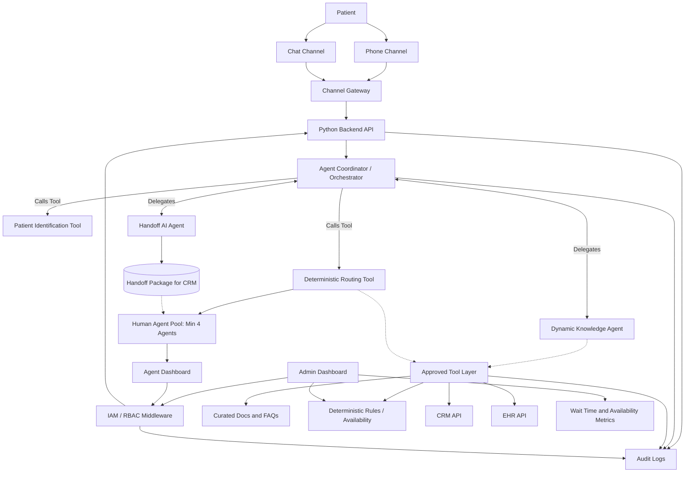

# Patient Assistant Plan

## 1. Problem Statement

Patients currently experience long wait times when contacting support, especially by phone, because they must wait until a human agent becomes available. Many patients do not find a human agent available at all, which creates missed contacts and weakens the reliability of the support experience.

The current process also creates inconsistent call handling. Some calls take longer than needed because agents must collect context manually, while other calls may be too short to capture the right patient need. Human agents may not have immediate access to patient history, or they may spend significant time fetching it from the database before they can respond effectively.

The business needs an agentic AI Patient Assistant for phone and chat that reduces wait time, improves availability, prepares human agents with relevant context, and supports tiered routing based on urgency, agent availability, intent, and loyalty/status priority.

The target outcome is a multi-agent AI orchestrated triage and handoff system where specialized AI agents collect patient context, apply routing rules, retrieve relevant CRM/EHR data, use a hybrid knowledge base that is not RAG alone, and hand off prepared cases to human agents.

## 2. User Stories

1. As a patient, I want to contact support by phone or chat and quickly have my request understood so that I do not wait unnecessarily for help.

2. As a human agent, I want to receive a summarized handoff with patient identity, intent, priority, and history so that I can resolve the case faster.

3. As an admin, I want to configure routing rules, loyalty priority, knowledge sources, and monitor wait/availability metrics so that the support operation stays efficient.

## 3. Product Requirements Document (PRD)

### Product Goal

Reduce patient wait time and improve agent availability through an omnichannel agentic AI assistant that coordinates specialized AI agents for orchestrated triage, patient-context retrieval, routing, and high-quality human handoff preparation.

### Target Users

- Patients using phone or chat support.
- Human support agents who receive patient handoffs.
- Admin and operations users who manage support rules, knowledge sources, and performance.

### Core Capabilities

- Accept patient interactions from phone or chat.
- Orchestrate specialized AI agents and deterministic tools through a central Orchestrator.
- Use a `Patient Identification Tool` to match incoming channel credentials (phone, email, WhatsApp, Messenger) to CRM identity or mark as a new customer.
- Use a `Dynamic Knowledge Agent` that actively pursues the user's goal across multiple data sources (curated docs, CRM, EHR, deterministic rules) and pivots when a chosen source lacks the required evidence.
- Implement deterministic tools for urgency/priority classification, routing decisions, and agent availability checks; these tools are invoked by the Orchestrator rather than being autonomous agents.
- Use a `Handoff AI Agent` to synthesize and package interaction context into a structured CRM case summary.
- Accept patient identity through channel-native credentials or detect the absence of CRM traces for new customers.
- Perform intent and urgency evaluation as part of the Orchestrator's reasoning loop (no separate triage agent required).
- Retrieve and synthesize relevant patient context dynamically from CRM and EHR systems.
- Use a hybrid knowledge base made of curated documents, deterministic business rules, and structured CRM/EHR API lookups—with intelligent source selection by the Dynamic Knowledge Agent.
- Apply routing based on urgency, availability, intent, and loyalty/status tier using a deterministic rules engine invoked by the Orchestrator.
- Prepare a human handoff package with patient identity, intent, priority, channel, summary, and relevant CRM/EHR history.
- Provide operational monitoring for wait time and availability.

### Success Metrics

- Reduced average patient wait time.
- Reduced unanswered calls and chats.
- Improved completeness of handoff information.
- Faster agent handling time after handoff.

### Constraints

- The operational human agent pool must include a minimum of 4 agents.
- The agentic AI design must include exactly 3 specialized AI agent roles: Orchestrator (which performs triage reasoning), Dynamic Knowledge Agent, and Handoff Agent. Deterministic tools cover identification, routing, and simple classification.
- Patient data must be treated as protected health information under a HIPAA-like privacy and security posture.
- The knowledge base must not rely on RAG alone.
- Version 1 channels are phone and chat.
- Version 1 automation covers orchestrated triage (by the Orchestrator), dynamic knowledge retrieval, and handoff preparation (not full self-service).

## 4. Functional Requirements Document (FRD)

### Agentic AI Requirements (Inputs, Outputs, and Tools)

- **Agent Coordinator (Orchestrator)**
  - *Role*: Central Orchestrator that maintains shared interaction state, performs triage reasoning (intent and urgency) as part of its decision loop, invokes deterministic tools, and delegates complex retrieval/synthesis work to the Dynamic Knowledge Agent and Handoff Agent.
  - *Inputs*: Channel-normalized patient messages and channel metadata (phone number, platform id).
  - *Outputs*: Routing decision, delegation commands for retrieval/synthesis, and final handoff payload.
  - *Tools*: `Patient Identification Tool`, `Routing Rules Engine`, `Urgency/Priority Classifier`, and subagent invocation primitives.
- **Patient Identification Tool (Deterministic Tool)**
  - *Role*: Deterministic identity matching across channels.
  - *Inputs*: Channel credential (phone, email, platform id), interaction metadata.
  - *Outputs*: Matched CRM identity or `new_customer` flag with normalized identity hints.
  - *Tools/Integrations*: CRM lookup, hashed PII matching, anti-fraud signals.
- **Dynamic Knowledge Agent (Essential Subagent)**
  - *Role*: Goal-seeking retrieval and reasoning agent that pursues the user's information goal across multiple sources, pivots when necessary, and composes context for handoff.
  - *Inputs*: Orchestrator-provided intent/goal, matched identity (when available), and interaction transcript.
  - *Outputs*: Synthesized context and evidence, prioritized list of relevant records and documents.
  - *Tools/Integrations*: Curated Document Search, CRM API, EHR API, Deterministic Rules Engine, and source-probing adapters.
- **Handoff AI Agent (Essential Subagent)**
  - *Role*: Synthesize collected evidence and interaction state into a concise, actionable CRM case/package suitable for human agents.
  - *Inputs*: Aggregated state from the Orchestrator and Dynamic Knowledge Agent.
  - *Outputs*: Standardized handoff package and optional CRM ticket creation.
  - *Tools/Integrations*: Context Formatter/Summarizer, CRM Case/Ticket Creator.
- The system must log agent decisions, tool calls, and handoff outputs for auditability.

### Intake Requirements (Identification)

- The system must accept patient requests from phone or chat.
- The system must attempt deterministic patient identification using available channel credentials (phone, email, WhatsApp, Messenger) via the `Patient Identification Tool` and mark customers with no CRM trace as `new`.
- The system must capture the patient's request reason in normalized form.
- The system must surface intent and urgency as outputs of the Orchestrator's reasoning loop.

### Knowledge Requirements

- The system must retrieve approved policy and FAQ content from curated documents.
- The system must apply deterministic business and routing rules when required.
- The system must query CRM APIs for structured patient and case context.
- The system must query EHR APIs for relevant patient history.
- The system must combine documents, rules, and structured APIs as a hybrid knowledge base.
- The system must not use RAG as the only knowledge mechanism.
- The Dynamic Knowledge Agent must be goal-seeking: it should evaluate which source is most likely to contain required evidence, attempt retrieval, and pivot to alternate sources until the goal is satisfied or exhaustion rules trigger.

### Routing Requirements

- The system must route based on urgency, agent availability, intent, and loyalty/status tier.
- The system must preserve urgent-case priority while also supporting loyalty/status-based tiered routing.
- The system must maintain a minimum operational pool of 4 human agents.

### Handoff Requirements

- The system must generate a concise handoff package before agent transfer.
- The Handoff AI Agent must generate the handoff package using aggregated state (identity, orchestrator-determined intent/urgency, dynamic knowledge evidence, routing decision, and CRM/EHR context).
- The handoff package must include:
  - Patient identity.
  - Request intent/goal.
  - Priority/urgency.
  - Channel.
  - Interaction summary.
  - Relevant CRM/EHR history and cited evidence.
- The human agent must be able to continue support using the prepared context.

### Admin Requirements

- Admin users must be able to configure routing rules.
- Admin users must be able to configure loyalty/status tiers.
- Admin users must be able to configure knowledge sources.
- Admin users must be able to view wait time and availability metrics.

### Security Requirements

- The system must use role-based access control.
- The system must create audit logs for access to patient-related information.
- The system must protect patient information using a HIPAA-like privacy and security posture.

## 5. User Workflow

1. A patient starts an interaction through phone or chat.
2. The channel gateway normalizes the interaction and sends it to the central Agent Coordinator (Orchestrator).
3. The Orchestrator invokes the `Patient Identification Tool` to match channel credentials (phone, email, platform id) to CRM identity or flag the user as new.
4. The Orchestrator performs intent and urgency evaluation natively as part of its reasoning loop.
5. The Orchestrator delegates retrieval and evidence-seeking to the *Dynamic Knowledge Agent*, which pursues the user's goal across curated docs, CRM, EHR, and deterministic rules—pivoting sources as necessary.
6. The Orchestrator invokes the deterministic *Routing Rules Engine* and *Availability Checker* to assess agent availability, urgency, intent, and calculate loyalty/status priority into a routing decision.
7. The Orchestrator delegates to the *Handoff AI Agent* to prepare a structured CRM case summary from the shared interaction state.
8. A human agent receives the prepared case in their dashboard and continues support.
9. An admin (authenticated via IAM/RBAC) monitors metrics and behaves rules through the Admin Dashboard.

## 6. Project Structure

```text
patient-assistant/
├── frontend/
│   ├── patient-chat/
│   ├── agent-dashboard/
│   └── admin-dashboard/
├── backend/
│   ├── app/
│   │   ├── api/
│   │   ├── agents/
│   │   ├── integrations/
│   │   ├── models/
│   │   ├── orchestration/
│   │   └── services/
│   │       ├── identification/
│   │       ├── routing/
│   │       ├── knowledge/
│   │       └── handoff/
│   └── tests/
└── docs/
```

### Structure Responsibilities

- `frontend/`: Patient chat UI, agent dashboard, and admin views.
- `backend/`: Python API services.
- `backend/app/api/`: REST and WebSocket endpoints.
-- `backend/app/agents/`: Specialized AI agents for the Orchestrator, Dynamic Knowledge Agent, and Handoff Agent (deterministic tools live in `services`).
- `backend/app/orchestration/`: Agent coordinator, agent state management, guardrails, and tool-call flow.
-- `backend/app/services/`: Identification, routing, knowledge, and handoff logic. (Triage reasoning lives in the Orchestrator.)
- `backend/app/integrations/`: CRM, EHR, telephony, and chat provider integrations.
- `backend/app/models/`: Domain models and schemas.
- `backend/tests/`: Backend test coverage.
- `docs/`: Product and architecture documentation.

## 7. Project Architecture

The system uses phone and chat channels connected to a channel gateway. The Python backend API hosts an agentic AI orchestration layer (the Orchestrator) that performs triage reasoning, invokes deterministic tools, and delegates complex retrieval and synthesis to specialized agents.

Core architecture components:

- Patient channels: phone and chat.
- Channel gateway: telephony and chat adapters.
- IAM / RBAC Middleware: Access control layer sitting in front of internal admin/agent access to secure APIs.
- API backend: Python service layer.
- Agent coordinator (Orchestrator): manages the multi-agent workflow, holds shared interaction state, performs intent/urgency triage, invokes deterministic tools, and delegates to essential agents (Dynamic Knowledge Agent and Handoff Agent).
- Patient Identification Tool: Deterministic service to match channel credentials to CRM identity or flag new customers.
- Dynamic Knowledge Agent: Essential subagent reasoning over curated documents, deterministic rules, and structured CRM/EHR API lookups with goal-seeking and pivoting behavior (Tools: Document Search, CRM API, EHR API).
- Routing Engine: Deterministic Orchestrator-invoked engine for agent availability, urgency, intent, and loyalty/status priority logic.
- Handoff AI agent: Essential subagent generating summaries and packaging CRM cases (Tools: Handoff Formatter, CRM creator).
- Tool layer: controlled, verifiable boundary abstracting CRM, EHR, classification, routing, rules, etc.
- Dashboards: Agent dashboard (patient case view) and Admin dashboard (metrics, rules), protected by IAM.
- Audit layer: tracks all access, orchestration states, and tool invocations.

## 8. Mermaid Architecture Diagram



## 9. Proposed Development Workflow

### Phase 1: Requirements Finalization and Domain Modeling

- Finalize patient, agent, admin, interaction, routing, priority, and handoff domain models.
- Define agent and tool responsibilities for the Orchestrator, Patient Identification Tool, Dynamic Knowledge Agent, Routing Engine, and Handoff Agent.
- Define shared agent state, tool permissions, and required audit events.
- Confirm CRM and EHR data required for handoff context.
- Define wait time, unanswered contact, and handoff completeness metrics.

### Phase 2: Backend Foundation

- Build the Python API foundation.
- Implement domain schemas and service boundaries.
- Implement the agent coordinator (Orchestrator).
- Implement skeletons for Dynamic Knowledge Agent and Handoff Agent.
- Implement deterministic services and tools: Patient Identification, Routing Engine, Urgency Classifier, and Availability Checker.
- Implement deterministic services used for validation and handoff formatting.

### Phase 3: CRM/EHR Integration

- Build CRM and EHR integration stubs.
- Connect real CRM and EHR adapters after interface validation.
- Add protected access patterns for patient context retrieval.
- Expose CRM and EHR access as controlled tools for the knowledge AI agent.

### Phase 4: Phone and Chat Integration

- Connect phone channel through a telephony adapter.
- Connect chat channel through a chat adapter.
- Normalize phone and chat interactions into the same identification workflow.
- Route normalized interactions into the Orchestrator.

### Phase 5: Agent and Admin Dashboards

- Build the agent dashboard for prepared handoff review.
- Build the admin dashboard for routing rules, loyalty tiers, knowledge sources, and operational metrics.

### Phase 6: Security, Audit, and Compliance Hardening

- Add role-based access control.
- Add audit logging for patient information access.
- Add audit logging for AI agent decisions, tool calls, and generated handoff summaries.
- Validate protected handling of patient information under the HIPAA-like privacy posture.

### Phase 7: Testing, Pilot Release, and Iteration

- Test identification, orchestrator triage (intent/urgency), routing, knowledge retrieval, handoff, agent orchestration, and admin workflows.
- Evaluate AI agent outputs for intent accuracy, urgency classification, routing correctness, and handoff completeness.
- Run a pilot release with phone and chat channels.
- Review wait time, unanswered contact, handoff completeness, and agent handling metrics.
- Iterate on routing rules, knowledge sources, and handoff quality.

## 10. PLAN.md Acceptance Checklist

- Includes an industry-standard problem statement.
- Includes exactly 3 distinct user stories.
- Includes a PRD.
- Includes an FRD.
- Includes a user workflow.
- Includes a project structure.
- Includes a project architecture.
- Includes a Mermaid code fence for the project architecture.
- Includes a proposed development workflow.
- Clearly represents the project as an agentic AI system.
- Includes an agent coordinator and specialized AI agents.
- Includes at least 4 specialized AI agent roles.
- Mentions phone and chat as version 1 channels.
- Mentions triage and handoff as version 1 automation.
- Mentions CRM and EHR integrations.
- Mentions that the knowledge base is hybrid and not RAG alone.
- Mentions minimum agents = 4.
- Mentions HIPAA-like privacy, auditability, and access control.
