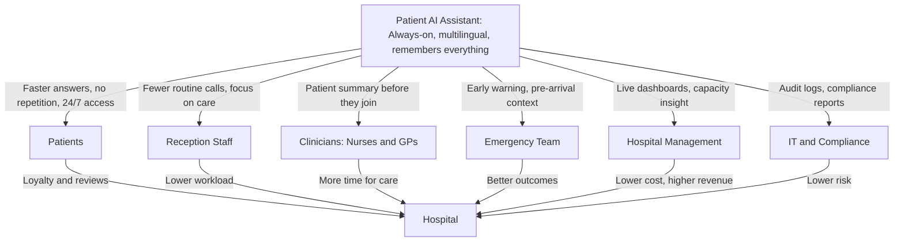
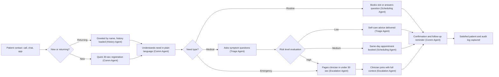
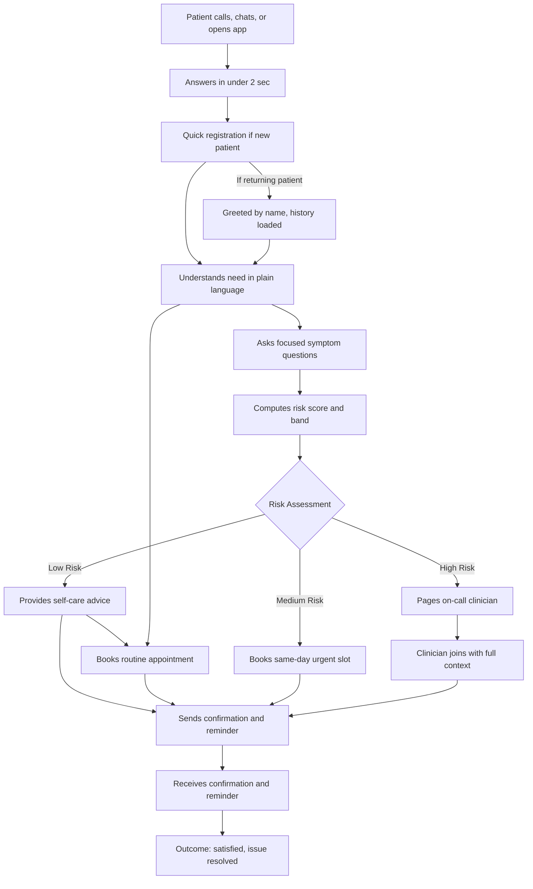
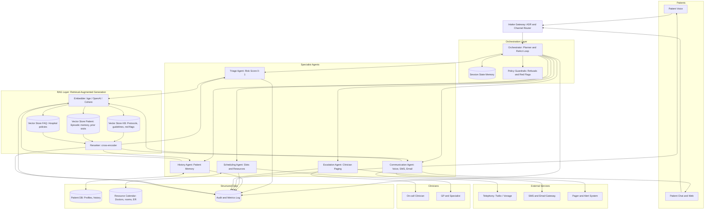

# Patient AI Assistant
### *A 24/7 Digital Front Door for the Hospital* (Business Proposal)

Hospitals lose time, money, and patient trust to a problem that is largely **administrative**: phone lines are jammed, receptionists repeat the same questions, clinicians lack context when patients call, and there is no consistent way to determine who needs help first.

The **Patient AI Assistant** is a 24/7 intelligent front door that answers calls and chats, remembers every patient, routes them to the right resource, and flags emergencies in seconds. It works alongside staff *— not in place of them —* and is designed to deliver measurable savings within the first year of deployment.

---

## 1. The Problem

Hospitals face the same five frustrations every day. None of them require new medicine to solve; they require better **coordination**.

### 1.1 Wasted Time
* Patients repeat the same information to every person they speak with.  
* Receptionists spend 40–60% of their day on questions that do not need a human.  
* Clinicians enter visits without context, so the first 3–5 minutes are spent catching up.

### 1.2 Limited Availability
* Phone lines are closed at night and on weekends.  
* Booking the right specialist can take multiple callbacks.  
* Emergency room capacity is invisible to patients until they arrive.

### 1.3 Long Call Times
* Average wait to reach a human: 4–12 minutes during peak hours.  
* 20–30% of callers abandon before being answered.  
* Each abandoned call is a lost visit and a frustrated patient.

### 1.4 No Continuity
* Every call starts from zero.  
* Clinicians do not remember a patient they saw 3 months ago.  
* Follow-ups depend on the patient remembering to call back.

### 1.5 No Prioritization
* Calls are answered in the order they arrive.  
* A chest-pain patient may wait behind a prescription refill.  
* Risk is identified too late.

---

## 2. The Solution and Who It Serves

---

## 3. Patient Journey

---

## 4. Data Requirements

### 4.1 Data Types

| Category | Examples | Source |
| :--- | :--- | :--- |
| **Patient demographics** | Age, sex, language, contact | Hospital registration |
| **Clinical history** | Diagnoses, meds, allergies, prior visits | EHR / mock dataset |
| **Current encounter** | Symptoms, vitals, chief complaint | Patient self-report + devices |
| **Resource data** | Doctor schedules, room status, on-call roster | Hospital admin system |
| **Interaction logs** | Call transcripts, chat history, agent decisions | System-generated |
| **Knowledge base** | Triage protocols, drug interactions | Medical guidelines (WHO, NICE) |

---

## 5. Ethics, Privacy, and Compliance

* **Informed Consent:** Required for AI interaction (verbal at call start, click-through on chat features).
* **Human-in-the-Loop:** Mandatory for any operational decision mapped above the yellow band tier.

> ### The 5-level Emergency Severity Index (ESI) Framework:
> * **Levels 1 & 2 (Red/Orange Bands):** Immediate life threats (e.g., anaphylaxis, severe trauma). System architecture must abort AI interaction, trigger a high-priority WebSocket alert to the charge nurse desk, and provide automatic phone routing.
> * **Level 3 (Yellow Band):** Requires multiple resources but stable vitals. This is where your AI context-gathering shines, summarizing the information for the clinician before they step in.
> * **Levels 4 & 5 (Green/Blue Bands):** Non-urgent schedules/refills. Fully automatable by your assistant framework.

* **Explainability:** Show the patient *why* they were routed (e.g., *"Based on your reported chest pain and history, we are routing you to..."*).
* **Compliance Posture:** Absolute structural alignment with **HIPAA** (US), **GDPR** (EU), and local medical-data sovereignty laws.
* **Bias Checks:** Continuous internal validation of system risk scoring across age, sex, and language subgroups.

---

## Guardrail Placement

### 1. The Output Guardrail
* **Where:** Post-Generation / Pre-Delivery. Positioned directly between the **Triage Agent** and the **User Output Channel**.  
* **Function:** Holds the generated response in a temporary state buffer. It acts as a synchronous interceptor to ensure the AI never delivers a definitive medical diagnosis (e.g., *"You are having a heart attack"*) and strictly sticks to safe triage protocol language.

### 2. The Input Guardrail
* **Where:** Post-Transcription / Pre-Routing. At the absolute front door before the payload hits the **Router Agent**.  
* **Function:** Sanitizes incoming text/audio data to block jailbreak attempts, adversarial prompt injections, or immediate red-band emergencies that must bypass conversational AI entirely.

---

## Technical System Architecture

