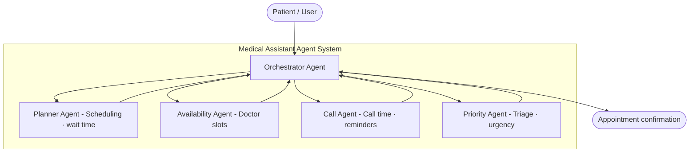

# Medical Assistant Agent — Simple Guide

---

## 1. Identify the Problem

Patients waste time when booking medical appointments:

- They don't know which doctor is **available** or when
- They wait too long in **queues** with no estimate
- They forget their appointment (no **reminder/call**)
- Urgent cases are not **prioritized** — a chest pain patient waits the same as a routine checkup
- No **planning** — the system doesn't suggest the best slot for the patient

> **The problem in one line:**
> The appointment process is slow, unorganized, and treats all patients the same — even emergencies.

---

## 2. Agent Structure 

We need **5 agents** — one orchestrator + four specialists:

### What Each Agent Does (Simple Words)

| # | Agent | Job | Input | Output |
|---|---|---|---|---|
| 1 | **Orchestrator Agent** | The boss — receives the request and sends it to the right agent | Patient message | Final answer to patient |
| 2 | **Priority Agent** | Decides how urgent the case is | Symptoms description | Priority level: `low / medium / high / emergency` |
| 3 | **Availability Agent** | Checks which doctor has free slots | Specialty + date | List of available slots |
| 4 | **Planner Agent** | Picks the best slot and estimates wait time | Available slots + priority + patient preference | Best slot + estimated wait time |
| 5 | **Call Agent** | Schedules a reminder call/SMS before the appointment | Confirmed appointment info | Reminder confirmation |

### Why These 5 and Not Less?

- You **can't remove Priority** — without it, emergency and routine cases are treated the same
- You **can't remove Availability** — without it, you don't know which doctor is free
- You **can't remove Planner** — without it, you can't estimate wait time or pick the best slot
- You **can't remove Call** — without it, patients forget appointments (high no-show rate)
- You **can't remove Orchestrator** — without it, agents don't talk to each other

---

## 3. Accuracy — How to Make It Reliable

| Risk | Problem | Solution |
|---|---|---|
| **Wrong priority** | Agent says "low" but it's actually an emergency | Use structured output (`TriageResult` with fixed categories) + clinical triage rules in the system prompt |
| **Outdated slots** | Agent suggests a slot that was already booked | Tools query the database in real-time — never rely on LLM memory for this |
| **Hallucinated doctor** | Agent invents a doctor name that doesn't exist | Only return data from the database tool, never from LLM general knowledge |
| **Missed reminder** | Call agent forgets to schedule | Output guardrail checks that reminder confirmation exists in the response |
| **Wrong slot picked** | Planner picks a slot that doesn't match patient preference | Validate output against the original patient request before confirming |

### Accuracy Best Practices

1. **Structured Outputs** — Use Pydantic models (`output_type=TriageResult`) so the LLM always returns the right format
2. **Real-time Tools** — Never let the LLM guess data. Always use `@function_tool` to query the real database
3. **Guardrails** — Input guardrails block bad requests; output guardrails catch missing or wrong fields
4. **Validation Step** — The Orchestrator double-checks all agent outputs before returning the final answer to the patient

---

## 4. Knowledge Base — RAG + What Else?

The agents need knowledge to work well. Here's the full picture:

### What Each Agent Needs to Know

| Agent | Knowledge Source | Type |
|---|---|---|
| **Priority Agent** | Clinical triage protocols (e.g., Emergency Severity Index) | **RAG** — retrieve relevant triage rules based on symptoms |
| **Availability Agent** | Doctor schedule database | **SQL / API** — real-time query, not RAG |
| **Planner Agent** | Scheduling rules (min gap, max daily patients) | **RAG** — clinic policies + **Rules Engine** for constraints |
| **Call Agent** | Communication templates (SMS text, call script) | **RAG** — retrieve the right template |
| **Orchestrator** | When to route to which agent | **System Prompt** — hardcoded logic, no RAG needed |

### System Architecture

### RAG + 3 More Things

| # | Knowledge Type | What It Is | When Used |
|---|---|---|---|
| 1 | **RAG (Vector DB)** | Store documents (triage protocols, policies, templates) and retrieve the relevant parts based on the patient's query | Priority Agent needs triage rules, Call Agent needs templates |
| 2 | **SQL / API (Live Data)** | Real-time database queries for doctor schedules and slot availability | Availability Agent must check live data, not old documents |
| 3 | **Rules Engine (Hard Logic)** | Code-level rules that the LLM cannot override (minimum gap between appointments, max patients per day, priority thresholds) | Planner Agent must respect scheduling constraints |
| 4 | **Guardrails (Safety Net)** | Input/output validators that catch errors before they reach the patient | Orchestrator validates all outputs before responding |

> **Important:** This system has **no patient history** (as you specified). So the Priority Agent relies only on the symptoms the patient describes right now + the triage protocols from RAG. No past visits, no chronic conditions, no medications.

---

## 5. Framework — OpenAI Agents SDK

### Why OpenAI Agents SDK?

| What You Need | How the SDK Provides It |
|---|---|
| Define agents | **Agent** — name, instructions, tools, handoffs all in one object |
| Tools (function calling) | **@function_tool** decorator — lets agents call your Python functions |
| Handoffs (agent-to-agent routing) | **handoff(agent)** — Orchestrator passes control to specialist agents |
| Structured outputs | **output_type** — forces the LLM to return an exact format (e.g., TriageResult) |
| Guardrails | **@input_guardrail** and **@output_guardrail** — validate before/after |
| Runner (execution engine) | **Runner.run()** — runs the whole flow from start to finish |
| Tracing | **Built-in** — every agent hop and tool call is logged automatically |

---

## Quick Summary Table

| Question | Answer |
|---|---|
| **Problem?** | Appointment booking is slow, unorganized, no priority, no reminders |
| **Minimum agents?** | 5 (Orchestrator + Priority + Availability + Planner + Call) |
| **How to ensure accuracy?** | Structured outputs + real-time tools + guardrails + validation |
| **Knowledge base?** | **RAG** (triage rules, templates) + **SQL/API** (live schedules) + **Rules Engine** (constraints) + **Guardrails** (safety) |
| **Framework?** | **OpenAI Agents SDK** — Agent, Runner, handoffs, tools, guardrails, tracing |
| **Patient history?** | No — system relies on current symptoms only |
