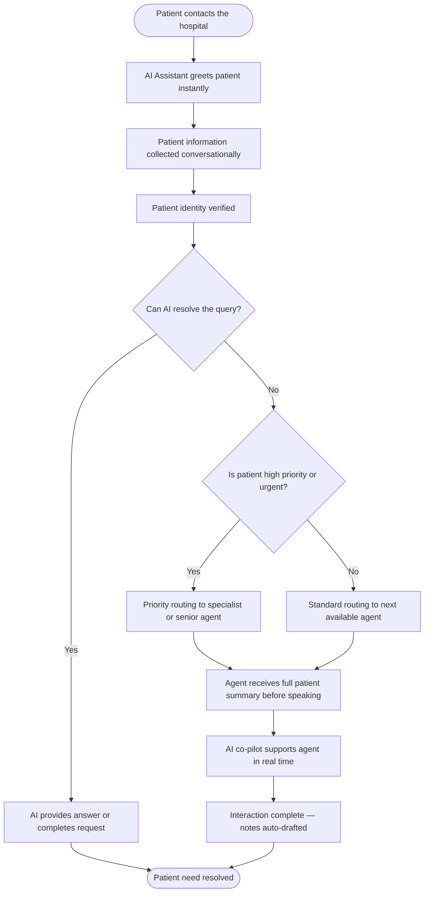

# AI-Powered Patient Support System
### Business Analysis & Solution Design Document

---

## Table of Contents

1. [Project Overview](#1-project-overview)
2. [Problem Analysis](#2-problem-analysis)
3. [Solution Overview](#3-solution-overview)
4. [AI Agent Responsibilities](#4-ai-agent-responsibilities)
5. [Knowledge Base](#5-knowledge-base)
6. [Implementation Plan](#6-implementation-plan)
7. [Expected Benefits](#7-expected-benefits)

---

## 1. Project Overview

### 1.1 Project Goal

The hospital will deploy an **AI-Powered Patient Support System** that acts as the first point of contact for every patient reaching out via phone, chat, or the hospital website. Intelligent AI assistants will handle the initial stages of every interaction — gathering information, verifying patient identity, answering common questions, and connecting patients to the right human agent — so that staff can focus their time and expertise where it matters most.

---

### 1.2 Business Objectives

| # | Objective | Success Metric |
|---|-----------|----------------|
| 1 | Ensure every patient receives an immediate response | AI responds within seconds, at any hour |
| 2 | Provide continuous patient support with no coverage gaps | 24/7 availability, including nights, weekends, and holidays |
| 3 | Eliminate repetitive data collection from agent workload | Patient information gathered before any human agent is involved |
| 4 | Guarantee no critical patient information is ever missed | All mandatory fields captured and confirmed on every interaction |
| 5 | Give agents instant access to patient history at the start of every call | Full patient summary presented to agent before the conversation begins |
| 6 | Reduce the time agents spend searching for information | Unified, AI-powered search across all hospital systems |
| 7 | Ensure VIP and high-priority patients receive differentiated service | Automatic priority routing based on patient status and urgency |

---

### 1.3 Who Benefits

| Stakeholder | How They Benefit |
|-------------|-----------------|
| **Patients** | Instant responses, no repeated questions, consistent and accurate answers |
| **Human Agents** | Less time on repetitive tasks, more time on meaningful patient conversations |
| **Department Managers** | Real-time visibility into support volumes, wait times, and service quality |
| **Hospital Leadership** | Measurable improvements in patient satisfaction, cost efficiency, and compliance |

---

## 2. Problem Analysis

### Problem 1 — Patients Wait Too Long Before Reaching Support

**What is happening:**
Patients who call or chat with the hospital are placed in a queue and may wait several minutes before anyone responds — even for simple inquiries. This is especially problematic during peak hours, when demand exceeds agent availability.

**Impact on patients and the hospital:**
- Patients abandon calls and chats out of frustration, leaving their needs unmet
- The hospital receives a poor first impression before any interaction even begins
- Staff face a backlog of calls that compounds throughout the day

**How the solution addresses this:**
An AI assistant responds to every patient the moment they make contact — day or night. It handles the opening of every conversation immediately, so patients are never left waiting in silence. Human agents are brought in only when the situation genuinely requires their judgment.

---

### Problem 2 — Patients Cannot Always Find an Available Agent

**What is happening:**
After business hours, on weekends, and during high-volume periods, patients reach out and find no one available to help. They are left with no alternative but to call back later or, in some cases, seek care elsewhere.

**Impact on patients and the hospital:**
- After-hours patients go without guidance, which can escalate minor concerns unnecessarily
- The hospital loses trust with patients who cannot reach support when they need it
- Urgent situations may not receive timely direction

**How the solution addresses this:**
The AI operates around the clock with no downtime. It answers common questions, schedules callbacks for the next available agent, collects relevant information, and — in genuinely urgent situations — alerts on-call staff. Patients always receive a response, regardless of the time.

---

### Problem 3 — Agents Spend Too Much Time Collecting Patient Information

**What is happening:**
Every call begins the same way: agents ask patients for their name, date of birth, patient ID, insurance details, reason for contact, and relevant medical background. This takes several minutes on every single interaction and consumes a significant portion of each agent's working day.

**Impact on patients and the hospital:**
- Patients feel their time is being wasted repeating information the hospital should already have
- Agents handle fewer patients per shift than they otherwise could
- The opening minutes of every call are spent on administration rather than care

**How the solution addresses this:**
Before a human agent ever enters the conversation, the AI assistant collects all required patient information through a natural, conversational exchange. When the agent joins, they receive a complete, pre-filled summary and can start addressing the patient's actual concern immediately.

---

### Problem 4 — Important Information Is Sometimes Missed During Calls

**What is happening:**
Under the pressure of high call volumes, agents occasionally overlook critical questions — failing to document allergies, current medications, or a complete description of the patient's concern. These gaps create downstream risks in care coordination and compliance.

**Impact on patients and the hospital:**
- Incomplete records can lead to clinical errors or misaligned care
- The hospital faces potential compliance and liability exposure
- Patients may need to repeat information during follow-up visits

**How the solution addresses this:**
The AI uses a structured checklist for every interaction, ensuring all required fields are completed before the conversation moves forward. During live agent calls, the AI co-pilot alerts agents in real time if mandatory information has not yet been captured, preventing any critical detail from slipping through.

---

### Problem 5 — Agents Do Not Have Quick Access to Patient History

**What is happening:**
When a patient is connected to an agent, the agent must locate the patient's record, review prior visits and notes, and piece together the relevant context — often while the patient waits. This process can take several minutes before the actual conversation can begin.

**Impact on patients and the hospital:**
- Patients feel unrecognized and must re-explain their history
- Agents cannot provide informed, personalized responses without first reviewing records
- Every call starts with avoidable delay

**How the solution addresses this:**
Once a patient's identity is confirmed, the system automatically retrieves and summarizes their full history — previous visits, active conditions, medications, known allergies, and open cases. This summary is presented to the agent before they speak to the patient, so the conversation can begin from a place of full context.

---

### Problem 6 — Agents Spend Too Much Time Searching Hospital Systems

**What is happening:**
Agents regularly need to look up policy information, check appointment availability, verify insurance details, or find answers to specific clinical questions. This requires switching between multiple separate hospital systems — a time-consuming process that keeps patients waiting and introduces inconsistency.

**Impact on patients and the hospital:**
- Average call handling times are unnecessarily extended
- Agents give inconsistent answers depending on which systems they can access quickly
- Agent fatigue increases as they navigate complex, fragmented information environments

**How the solution addresses this:**
The AI provides agents with a single, unified interface. Agents ask a question in plain language, and the AI searches across all connected hospital systems simultaneously, surfacing the most relevant answer within seconds. Agents no longer need to know which system holds which information.

---

### Problem 7 — Patient Priority Status Is Not Used Effectively

**What is happening:**
VIP patients, patients with chronic or complex conditions, and patients describing urgent symptoms are placed in the same general queue as routine inquiries. There is no automatic mechanism to recognize and elevate their priority.

**Impact on patients and the hospital:**
- High-priority patients experience delays that damage trust and relationships
- Clinical risk increases when urgent cases are not escalated appropriately
- The hospital's obligation to differentiated care for specific patient groups is not consistently met

**How the solution addresses this:**
The system automatically reads each patient's priority status and evaluates the urgency of their concern during the intake stage. High-priority patients are routed to the appropriate resource immediately, bypassing standard queues — without the patient needing to ask for special treatment.

---

## 3. Solution Overview

### 3.1 How the System Works

The AI-Powered Patient Support System works as an intelligent layer between patients and human agents. Every patient interaction passes through a series of AI-assisted steps that prepare both the patient and the agent for a faster, more effective conversation.

---

### 3.2 System Components

| Component | What It Does | Who It Serves |
|-----------|-------------|---------------|
| **Patient Contact Channels** | Phone, live chat, hospital website, and mobile app — patients choose how they reach out | Patients |
| **AI Assistant** | Responds instantly, collects information, answers common questions, and manages the handoff to human agents | Patients |
| **Patient Identity Verification** | Confirms who the patient is and retrieves their records before the conversation continues | Patients & Agents |
| **Smart Routing Engine** | Directs each patient to the right resource based on urgency, priority status, and agent availability | Operations |
| **Agent Workspace** | A unified screen where agents see the patient summary, AI suggestions, and all relevant information in one place | Human Agents |
| **AI Co-Pilot** | Supports agents during live calls by surfacing information, flagging missing details, and drafting call notes | Human Agents |
| **Hospital Knowledge Base** | A curated repository of hospital policies, FAQs, and clinical information that the AI uses to answer questions | Patients & Agents |
| **Operations Dashboard** | Real-time visibility into patient volumes, wait times, resolution rates, and agent performance | Managers & Leadership |

---

### 3.3 Patient Experience Flow

From the patient's perspective, the experience is seamless:

1. The patient contacts the hospital through any channel and is greeted immediately — no hold music, no queue message
2. The AI has a short, natural conversation to understand their need and collect their details
3. If their question can be answered right away, the AI provides the answer
4. If they need a human agent, they are connected — and the agent already knows who they are and why they are calling
5. The patient never needs to repeat themselves

---

## 4. AI Agent Responsibilities

The system is powered by five specialized AI agents, each responsible for a specific stage of the patient interaction. They work in sequence, passing context from one to the next, so that every step builds on what came before.

---

### 4.1 Patient Intake Agent

**Purpose:**
To be the first voice or message a patient encounters. This agent greets the patient warmly, determines the reason for their contact, and collects all necessary information before passing the conversation on.

| | Detail |
|---|--------|
| **Receives** | The patient's initial message or spoken request |
| **Delivers** | A complete, structured summary of the patient's contact reason, details, and urgency level |
| **Business Value** | Eliminates the intake burden from human agents entirely; ensures no call begins without a full picture |

---

### 4.2 Authentication Agent

**Purpose:**
To confirm the patient's identity and retrieve their records from the hospital's systems. This agent ensures that every subsequent step in the interaction is grounded in accurate, up-to-date patient information.

| | Detail |
|---|--------|
| **Receives** | Patient-provided identifying information (name, date of birth, patient ID, or registered phone number) |
| **Delivers** | Confirmed patient identity; full patient profile including visit history, conditions, medications, allergies, and priority flags |
| **Business Value** | Ensures agents always have the right patient in front of them; surfaces VIP and priority status automatically |

---

### 4.3 Knowledge Base Agent

**Purpose:**
To answer patient questions and support human agents by instantly retrieving accurate information from the hospital's knowledge base, policies, and procedures — without requiring anyone to search manually.

| | Detail |
|---|--------|
| **Receives** | A patient question or an agent's search request, along with the patient's context |
| **Delivers** | A clear, concise answer drawn from verified hospital content, with a confidence indicator |
| **Business Value** | Provides consistent, accurate answers across all agents and channels; eliminates time lost to manual searching |

---

### 4.4 Routing Agent

**Purpose:**
To ensure every patient is directed to exactly the right resource at the right time. This agent evaluates the patient's urgency, priority status, and contact reason, then matches them to the most appropriate available agent or department.

| | Detail |
|---|--------|
| **Receives** | Intake summary, verified patient profile including priority flags, urgency assessment, and real-time agent availability |
| **Delivers** | A routing decision — self-service resolution, standard agent queue, priority escalation, specialist referral, or scheduled callback |
| **Business Value** | Ensures high-priority and VIP patients receive differentiated service automatically; optimizes agent utilization across departments |

---

### 4.5 Human Agent Assist Agent

**Purpose:**
To act as a real-time support partner for human agents during live interactions. This agent monitors the conversation, surfaces relevant information proactively, alerts agents to any missing details, and handles documentation — allowing agents to focus entirely on the patient.

| | Detail |
|---|--------|
| **Receives** | The live conversation transcript, the patient's full profile, and the agent's in-conversation queries |
| **Delivers** | Suggested responses, missing-information alerts, instant answers to agent queries, and a complete draft of call notes at the end of the interaction |
| **Business Value** | Reduces cognitive load on agents, improves documentation accuracy, and shortens average handling time on every call |

---

## 5. Knowledge Base

### 5.1 What Information the Knowledge Base Contains

The knowledge base is the hospital's central repository of information that the AI draws on to answer questions and support agents. It is designed to reflect the hospital's own voice, policies, and standards.

| Category | What It Includes |
|----------|-----------------|
| **Hospital Policies** | Visiting hours, admission and discharge procedures, patient rights, billing and payment policies |
| **Department Information** | Services offered, contact details, hours of operation, and referral procedures for each department |
| **Appointment & Scheduling** | How to book, change, or cancel appointments; preparation instructions for procedures |
| **Insurance & Billing** | Accepted insurance providers, payment plan options, how to submit or query a claim |
| **Clinical Guidance** | General symptom guidance for common concerns; when to seek urgent or emergency care |
| **Frequently Asked Questions** | The most common patient inquiries with reviewed, approved answers |
| **Emergency Information** | When and how to access emergency services; directions to the emergency department |

---

### 5.2 How the AI Uses It

The AI does not simply search for keywords. It understands the meaning and intent behind a patient's question and retrieves the most relevant, contextually appropriate answer — even if the patient's phrasing does not exactly match the wording in any document.

Each answer is assessed for confidence before being delivered. If the AI is not sufficiently confident in an answer, it flags this and routes the question to a human agent rather than risk providing inaccurate guidance.

---

### 5.3 How It Will Be Maintained

The knowledge base is a living resource. It is only as valuable as it is current and accurate, so a clear ownership and review model is essential.

| Activity | Frequency | Owner |
|----------|-----------|-------|
| Scheduled content review and update | Monthly | Clinical and Operations teams |
| Addition of new policies or procedures | As needed, triggered by any policy change | Department leads and Content Manager |
| Review of unanswered or low-confidence queries | Monthly | Operations and Quality Assurance |
| Patient satisfaction and accuracy audit | Quarterly | Quality Assurance and Hospital Leadership |

---

## 6. Expected Benefits

### 6.1 Faster Response for Patients

| Situation | Current Experience | With AI System |
|-----------|-------------------|----------------|
| Patient contacts during business hours | Waits in queue for 5–15 minutes | Greeted instantly; human agent within 2 minutes if needed |
| Patient contacts after hours or on weekends | No one available; patient must call back | AI responds immediately at any hour |
| Urgent patient needs to bypass the queue | No mechanism exists | Automatically elevated based on urgency and priority status |

---

### 6.2 More Productive, Less Burdened Agents

| Task | Time Spent Today | Time Spent With AI System |
|------|-----------------|--------------------------|
| Collecting patient information at the start of a call | 3–5 minutes per call | None — already done before handoff |
| Searching across hospital systems for answers | 3–6 minutes per call | Under 30 seconds via unified AI search |
| Writing up call notes after each interaction | 3–5 minutes per call | Under 1 minute — AI drafts notes automatically |
| Handling patient calls per shift | Baseline | Estimated 40% increase in capacity |

---

### 6.3 Higher Patient Satisfaction

- Every patient is acknowledged immediately, with no hold time and no unanswered contacts
- Patients are not asked to repeat information they have already provided
- VIP and priority patients receive a visibly elevated level of service without needing to request it
- Answers are consistent and accurate regardless of which agent or channel a patient uses
- **Projected improvement in patient satisfaction scores: +25 to +40 points**

---

### 6.4 Stronger Operational Performance

| Area | Expected Outcome |
|------|-----------------|
| Abandoned contacts (patients who hang up or leave) | Reduced by 50–70% |
| Compliance documentation completeness | All mandatory fields captured on every interaction |
| Correct routing on first contact | Improved from an estimated 60–70% today to over 95% |
| Consistency of information given to patients | Unified AI knowledge base eliminates agent-to-agent variation |
| Management visibility into support operations | Real-time dashboard replaces end-of-day manual reporting |

---

### 6.5 Summary of Value

The AI-Powered Patient Support System delivers value across every dimension of hospital support operations. Patients receive better, faster, more consistent care. Agents are freed from repetitive administrative tasks and empowered to have more meaningful conversations. Hospital leaders gain the visibility they need to measure, manage, and continuously improve the quality of patient support — at scale and without proportional increases in staffing costs.

---

> **Document End**  
> This document should be reviewed and updated at the conclusion of each implementation phase. All material changes to scope, priorities, or timelines require sign-off from the project steering committee.
