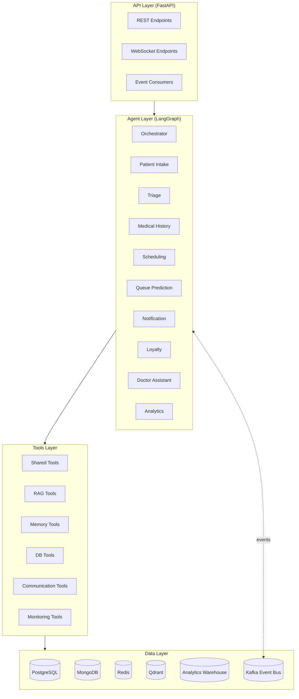
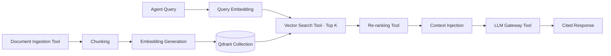
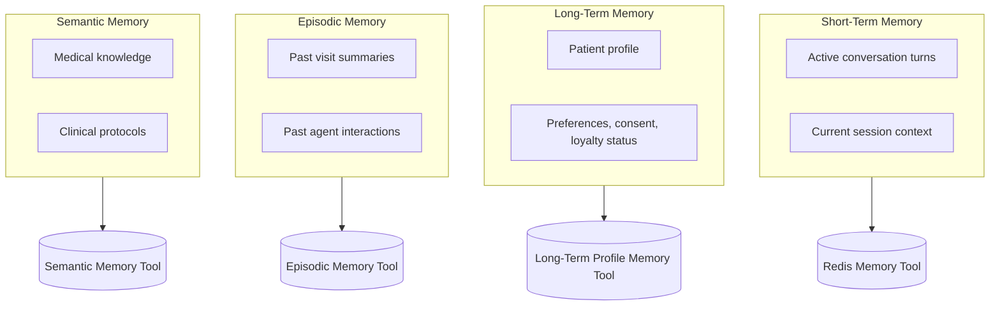

# Agentic AI Healthcare Patient Management System
## Technical Implementation Architecture

**Document Type:** Agent & Tools Technical Specification
**Audience:** Engineering Teams / Implementation


---

## Table of Contents

1. [System Overview](#1-system-overview)
2. [Agent Technical Architecture](#2-agent-technical-architecture)
3. [Agent Tools Architecture](#3-agent-tools-architecture)
4. [Production Agent System Prompts](#4-production-agent-system-prompts)
5. [RAG Architecture](#5-rag-architecture)
6. [Memory Architecture](#6-memory-architecture)
7. [Vector Database Design](#7-vector-database-design)
8. [Technology Stack Selection](#8-technology-stack-selection)
9. [Production Repository Structure](#9-production-repository-structure)

---

## 1. System Overview

The system is a single FastAPI application exposing REST and event-driven entry points, backed by a LangGraph-orchestrated multi-agent core. There is no frontend/backend split in this spec — every channel (app, web, WhatsApp, voice, call center) talks to the same API surface; UI concerns are out of scope here. The system has four layers:



| Layer | Responsibility |
|-------|-----------------|
| **API Layer** | FastAPI routers per domain (patients, appointments, notifications, staff). Normalizes all channel input into a single internal message schema and invokes the Orchestrator graph. No business logic lives here. |
| **Agent Layer** | 10 LangGraph-defined agents (1 orchestrator + 9 specialized). Each agent is a stateless graph node/subgraph invoked with a typed input, executes its internal workflow, calls tools, and returns a typed output. |
| **Tools Layer** | The only layer permitted to talk to external systems and databases. Agents never call a database driver or external API directly — they call a tool, which encapsulates auth, retries, schema validation, and audit logging. Full spec in Section 3. |
| **Data Layer** | PostgreSQL (structured/relational), MongoDB (flexible schema), Redis (cache + short-term memory), Qdrant (vectors), Analytics Warehouse (OLAP), Kafka (event bus). |

### 1.1 Agent Inventory

| # | Agent | Role |
|---|-------|------|
| 1 | Orchestrator | Intent classification, routing, escalation gating |
| 2 | Patient Intake | New/updated patient data collection & validation |
| 3 | Triage | Symptom extraction & risk scoring |
| 4 | Medical History | Unified clinical history retrieval & summarization |
| 5 | Scheduling | Appointment slot search, booking, rescheduling |
| 6 | Queue Prediction | Wait-time forecasting |
| 7 | Notification | Multi-channel patient communication |
| 8 | Loyalty | Retention, re-engagement, rewards |
| 9 | Doctor Assistant | Pre-visit briefs, SOAP note drafting, action extraction |
| 10 | Analytics & Optimization | KPI computation, anomaly detection, recommendations |


---

## 2. Agent Technical Architecture

Each agent is a LangGraph node (or subgraph, for multi-step agents like Triage and Doctor Assistant). All agents are **stateless between invocations** — any state they need is fetched from a tool at the start of the call and persisted via a tool before returning. This is what makes every agent independently horizontally scalable.

---

### 2.1 Orchestrator Agent

**Agent Purpose:** Central router and session owner. Classifies intent, resolves patient identity, decides which agent(s) to invoke and in what order, aggregates responses, and gates escalation.

**Agent Inputs:**
```json
{
  "session_id": "uuid",
  "channel": "app | web | voice | whatsapp | call_center",
  "raw_message": "string",
  "patient_id": "uuid | null"
}
```

**Agent Outputs:**
```json
{
  "route_to": ["agent_name", "..."],
  "priority": "CRITICAL | URGENT | STANDARD | null",
  "aggregated_response": "string",
  "escalation_event": "object | null"
}
```

**Internal Workflow:**
1. Load `SessionContext` via **Session Context Tool** (create if `session_id` is new).
2. Run deterministic red-flag keyword scan on `raw_message` (in-process, no tool call — must execute in <5ms). If matched → set `priority=CRITICAL`, skip steps 3–4, go directly to step 5 with `route_to=["triage"]`.
3. If `patient_id` is null, call **Identity Resolution Tool** with channel identifier. If still unresolved → `route_to=["patient_intake"]`, skip remaining classification.
4. Call **LLM Gateway Tool** with intent-classification prompt (Section 4.1) → returns `{intent, route_to, priority, reasoning}`.
5. Invoke target agent(s) as LangGraph subgraph calls — sequential if downstream agent depends on upstream output (e.g., `medical_history` → `scheduling`), parallel otherwise.
6. Aggregate per-agent responses into a single patient-facing reply.
7. Persist updated `SessionContext` (**Session Context Tool**) and publish a `session.routed` event (**Event Publisher Tool**) for the Analytics pipeline.
8. Write the routing decision to the audit trail (**Audit Logger Tool**).

**Tools Used by the Agent:**

| Tool | Why the Agent Needs It | Input | Output |
|------|--------------------------|-------|--------|
| LLM Gateway Tool | Intent classification and dialogue management | message + history | intent, route_to, priority, reasoning |
| Session Context Tool | Load/persist the cross-agent session state | session_id | SessionContext object |
| Identity Resolution Tool | Resolve patient_id from a channel identifier | phone / app_id | patient_id or null |
| Event Publisher Tool | Emit `session.routed` / `emergency.escalated` events | event payload | publish ack |
| Audit Logger Tool | Immutable record of every routing decision | decision record | log_id |
| Config & Feature Flag Tool | Select active routing rules / prompt version | agent_name | config object |

---

### 2.2 Patient Intake Agent

**Agent Purpose:** Converts conversational input into a validated, structured patient record for new patients, and applies updates to existing demographic/insurance data.

**Agent Inputs:** Conversational responses (name, DOB, phone, email, national ID/insurance number, emergency contact), optional partial profile if mid-flow.

**Agent Outputs:**
```json
{"patient_id": "uuid", "profile": {"...":"..."}, "consent": {"given": true, "version": "...", "timestamp": "..."}}
```

**Internal Workflow:**
1. Load any in-progress partial profile from **Session Context Tool**.
2. Determine next unfilled required field; ask for it via **LLM Gateway Tool** (one or two fields per turn).
3. On each response, extract the field value (**LLM Gateway Tool**) and validate format/plausibility (**Validation & Duplicate-Match Tool**).
4. If invalid → re-prompt for that field only (loop back to step 2).
5. After name + DOB + phone are collected, run a fuzzy duplicate check (**Validation & Duplicate-Match Tool**) against existing records via **Patient DB Tool**. If a likely duplicate is found, surface it for confirmation before creating a new record.
6. Once all required fields pass validation, capture explicit consent (data processing + HIPAA acknowledgment) and write the finalized profile (**Patient DB Tool**).
7. Log consent capture and record creation (**Audit Logger Tool**).
8. Return `patient_id` to the Orchestrator.

**Tools Used by the Agent:**

| Tool | Why the Agent Needs It | Input | Output |
|------|--------------------------|-------|--------|
| LLM Gateway Tool | Conversational field extraction | patient utterance | extracted field value |
| Validation & Duplicate-Match Tool | Format validation + fuzzy duplicate detection | field value / candidate record | valid (bool), duplicate matches |
| Patient DB Tool | Create/read the patient record | profile object | patient_id |
| Insurance Verification API | Validate insurance/coverage number format and active status | insurance_id | coverage status |
| Session Context Tool | Persist partial profile across turns | session_id, partial profile | ack |
| Audit Logger Tool | Log consent capture and record creation | consent record | log_id |

---

### 2.3 Triage Agent

**Agent Purpose:** Extracts symptoms and produces an auditable, deterministic risk tier. The system's single most safety-critical agent — designed to over-trigger on ambiguous signals rather than miss an emergency.

**Agent Inputs:** Reported symptoms (text/voice), `patient_id` (optional), onset/duration.

**Agent Outputs:**
```json
{
  "risk_tier": "CRITICAL | URGENT | STANDARD | NON_URGENT",
  "symptoms": ["..."],
  "red_flags_detected": ["..."],
  "escalation_flag": true
}
```

**Internal Workflow:**
1. Run deterministic red-flag keyword scan **first**, before any LLM call (chest pain, breathing difficulty, loss of consciousness, severe bleeding, stroke signs, suicidal ideation). A match short-circuits to step 6 immediately.
2. If no immediate red flag, call **LLM Gateway Tool** to extract structured symptoms (onset, severity self-report, location, associated symptoms) from free text.
3. Pull known conditions/allergies via **Clinical Records DB Tool** to contextualize scoring (e.g., known cardiac history raises chest-pain weighting).
4. Query relevant clinical scoring criteria via **Semantic Memory Tool** (RAG over `clinical_protocols` collection) — used as scoring *support*, never as the final decision-maker.
5. Pass structured symptoms + retrieved criteria to the **Rules Engine Tool** (clinical rule-set) → returns a deterministic ESI-aligned tier. This step, not the LLM, owns the final score.
6. On `CRITICAL` or low-confidence output: call **Escalation/Paging Tool** synchronously (bypasses the async event bus for latency) and publish `emergency.escalated` (**Event Publisher Tool**) for downstream audit/analytics.
7. Log the full reasoning chain — extracted symptoms, retrieved criteria, rule output — via **Audit Logger Tool** (required for clinical defensibility).

**Tools Used by the Agent:**

| Tool | Why the Agent Needs It | Input | Output |
|------|--------------------------|-------|--------|
| LLM Gateway Tool | Structured symptom extraction from free text | patient utterance | symptoms, onset, severity |
| Rules Engine Tool | Deterministic ESI-aligned risk scoring | structured symptoms + criteria | risk_tier |
| Semantic Memory Tool | Retrieve relevant clinical scoring criteria | symptom keywords | protocol excerpts |
| Clinical Records DB Tool | Pull known conditions/allergies for context | patient_id | conditions, allergies |
| Escalation/Paging Tool | Immediate human alert on CRITICAL | risk bundle | page confirmation |
| Event Publisher Tool | Publish `emergency.escalated` for audit/analytics | event payload | publish ack |
| Audit Logger Tool | Defensible record of the full scoring chain | reasoning trace | log_id |

---

### 2.4 Medical History Agent

**Agent Purpose:** Single source of truth for a patient's longitudinal clinical history across branches/departments. Produces role-appropriate summaries (terse for Scheduling, detailed for Doctor Assistant).

**Agent Inputs:** `patient_id`, `requesting_agent` (determines summary depth), `query_context`.

**Agent Outputs:**
```json
{"summary": "string", "clinical_flags": {"allergies": [...], "chronic_conditions": [...]}, "relevant_visits": [...]}
```

**Internal Workflow:**
1. Fetch structured clinical fields (diagnoses, labs, vitals, medications) via **Clinical Records DB Tool**; if the hospital's source-of-truth is an external EHR, fetch via **EHR API Connector** instead/in addition.
2. Run semantic retrieval over the patient's clinical notes via **Retrieval Tool**, hard-filtered on `patient_id` (never a soft preference — see Section 7.5).
3. Merge structured + retrieved unstructured context.
4. Generate the summary via **LLM Gateway Tool**, with depth/format controlled by `requesting_agent` (one-line for Scheduling, full SOAP-trend summary for Doctor Assistant).
5. Always surface allergies and active medications first in the output, regardless of `query_context`.
6. If a field is missing/incomplete, state that explicitly rather than inferring it.
7. Log the PHI access (**Audit Logger Tool**).

**Tools Used by the Agent:**

| Tool | Why the Agent Needs It | Input | Output |
|------|--------------------------|-------|--------|
| Clinical Records DB Tool | Structured field read (labs, diagnoses, meds) | patient_id | structured record |
| EHR API Connector | Pull records from external hospital EHR/HIS | patient_id (FHIR id) | FHIR bundle |
| Retrieval Tool | Semantic search over the patient's clinical notes | patient_id + query | ranked note excerpts |
| Patient Profile Tool | Basic demographic context for the summary header | patient_id | name, age, sex |
| LLM Gateway Tool | Role-appropriate summarization | structured + retrieved context | summary text |
| Audit Logger Tool | Log every PHI read | access record | log_id |

---

### 2.5 Scheduling Agent

**Agent Purpose:** Books, reschedules, and cancels appointments — balancing patient convenience, continuity of care, and doctor utilization.

**Agent Inputs:** Booking request (specialty, doctor preference, time window), `priority` from Triage if present, `patient_id`.

**Agent Outputs:**
```json
{"doctor_id": "...", "slot_start": "...", "slot_end": "...", "location": "...", "booking_ref": "..."}
```

**Internal Workflow:**
1. Query raw doctor availability via **Doctor Availability Tool** (wraps the external **Doctor Scheduling API** plus buffer-time rules).
2. If `priority` is `CRITICAL`/`URGENT`, bypass normal constraint ranking and request the next clinically-appropriate emergency slot directly.
3. Otherwise, run the **Appointment Recommendation Tool**, which scores candidate slots on: patient's stated time preference, continuity-of-care (same doctor, via **Patient Profile Tool** visit history), and predicted wait (**Queue Prediction Model**).
4. Present top 1–3 options conversationally via **LLM Gateway Tool**.
5. On patient confirmation, persist the booking with conflict/double-booking checks via **Scheduling DB Tool**.
6. Create the calendar entry (**Calendar Tool**).
7. Publish `appointment.booked` / `.cancelled` / `.rescheduled` (**Event Publisher Tool**) for Notification, Loyalty, and Analytics subscribers.

**Tools Used by the Agent:**

| Tool | Why the Agent Needs It | Input | Output |
|------|--------------------------|-------|--------|
| Doctor Availability Tool | Raw slot availability with buffer rules applied | specialty/doctor/date range | candidate slot list |
| Appointment Recommendation Tool | Rank candidate slots by preference + continuity + wait | candidate slots + context | ranked top 1-3 slots |
| Queue Prediction Model | Predicted wait time per candidate slot | doctor_id, slot_time | predicted_wait_minutes |
| Calendar Tool | Create the confirmed calendar entry | booking details | calendar_event_id |
| Scheduling DB Tool | Persist booking, enforce conflict checks | booking object | booking_ref |
| LLM Gateway Tool | Conversational slot negotiation | candidate slots | natural-language options |
| Event Publisher Tool | Emit booking lifecycle events | event payload | publish ack |

---

### 2.6 Queue Prediction Agent

**Agent Purpose:** Forecasts near-future wait times per doctor/department from real-time queue state and historical patterns; primarily a quantitative ML service with a thin LLM translation layer.

**Agent Inputs:** Current queue state, doctor check-in/check-out events, historical visit-duration data.

**Agent Outputs:** `{"predicted_wait_minutes": [low, high], "confidence": 0.0-1.0, "doctor_id": "...", "slot_time": "..."}`

**Internal Workflow:**
1. Consume real-time check-in/check-out events from the queue stream.
2. Run the forecasting model (**Queue Prediction Model**) against current state + historical patterns (**Analytics Warehouse Tool**) to produce a confidence-bounded wait estimate.
3. On significant drift (doctor running >10 min behind baseline), trigger a re-estimation pass and notify Scheduling of affected upcoming slots.
4. Translate the numeric output into a patient-friendly status string via **LLM Gateway Tool** when called from a patient-facing context (never state false precision — always a range).

**Tools Used by the Agent:**

| Tool | Why the Agent Needs It | Input | Output |
|------|--------------------------|-------|--------|
| Queue Prediction Model | Core time-series forecast | queue state, history | wait estimate + confidence |
| Analytics Warehouse Tool | Historical duration patterns for model features | doctor_id, date range | historical aggregates |
| LLM Gateway Tool | Translate model output to patient-friendly text | wait estimate | natural-language status |
| Tracing/Observability Tool | Track real-time event-processing latency | event stream | latency metrics |

---

### 2.7 Notification Agent

**Agent Purpose:** Owns all proactive and reactive patient/staff communication across channels, with appropriate timing, tone, and channel selection.

**Agent Inputs:** Event trigger (`appointment.booked`, `emergency.escalated`, lab-result-ready, reminder-due), patient channel preferences.

**Agent Outputs:** `{"sent": true, "channel": "...", "delivery_status": "..."}`

**Internal Workflow:**
1. Consume the triggering event from the event bus.
2. Look up channel preference and contact info via **Patient Profile Tool**.
3. Select channel by urgency: emergency → call/SMS via **Escalation/Paging Tool** + **Messaging Gateway Tool**; routine → app push/WhatsApp via **Messaging Gateway Tool**.
4. Generate the message via **LLM Gateway Tool**, localized via **Translation/Localization Tool**.
5. De-duplicate against recently-sent notifications for the same event (**Notification Service** internal de-dup check).
6. Dispatch and record delivery status (**Notification Service**, which wraps **Messaging Gateway Tool**).

**Tools Used by the Agent:**

| Tool | Why the Agent Needs It | Input | Output |
|------|--------------------------|-------|--------|
| Notification Service | Orchestrates templating, de-dup, timing, dispatch | event + patient context | delivery record |
| Messaging Gateway Tool | Actual send via WhatsApp/SMS/Push | channel, message, recipient | delivery status |
| Escalation/Paging Tool | Page on-call human staff for CRITICAL events | escalation bundle | page confirmation |
| LLM Gateway Tool | Personalize message tone/content | event_type, context | message text |
| Translation/Localization Tool | Localize message to patient's language | message, language_preference | localized message |
| Patient Profile Tool | Channel preference and contact info | patient_id | contact details |

---

### 2.8 Loyalty Agent

**Agent Purpose:** Drives retention via lapsed-patient detection, personalized re-engagement, and loyalty points/tier management.

**Agent Inputs:** Visit history, engagement history, time since last visit.

**Agent Outputs:** `{"action": "...", "reason": "...", "suggested_message_tone": "..."}` (sent to Notification Agent) or loyalty status updates.

**Internal Workflow:**
1. On a scheduled scan or `appointment.completed`/`appointment.cancelled` event, pull visit + engagement history (**Loyalty DB Tool**, **Analytics Warehouse Tool**).
2. Run lapsed-patient and milestone detection via the **Rules Engine Tool** (loyalty rule-set: thresholds, point accrual, tier boundaries).
3. If a re-engagement action is warranted, generate the recommendation payload via **LLM Gateway Tool** (action, reason, tone) and publish it for the Notification Agent (**Event Publisher Tool**).
4. Update points/tier in **Loyalty DB Tool**.

**Tools Used by the Agent:**

| Tool | Why the Agent Needs It | Input | Output |
|------|--------------------------|-------|--------|
| Loyalty DB Tool | Read/write points, tier, engagement state | patient_id | loyalty record |
| Rules Engine Tool | Deterministic points/tier/lapse-threshold logic | loyalty record | action recommendation |
| Analytics Warehouse Tool | Engagement scoring inputs | patient_id, history | engagement metrics |
| LLM Gateway Tool | Personalized re-engagement copy | recommendation context | message draft |
| Event Publisher Tool | Hand the recommendation to Notification Agent | recommendation payload | publish ack |

---

### 2.9 Doctor Assistant Agent

**Agent Purpose:** Reduces clinical admin burden — pre-visit briefs, SOAP note drafting, action-item extraction — with a mandatory human-approval checkpoint before anything is committed to the EHR.

**Agent Inputs:** `patient_id`, doctor's dictated/typed notes, pre-visit history.

**Agent Outputs:** Draft SOAP note, extracted action items, pre-visit brief — all marked `[DRAFT — Pending Doctor Approval]` until explicitly approved.

**Internal Workflow:**
1. Pre-visit: request a role-scoped summary from the Medical History Agent (agent-to-agent call) → render as a <150-word brief via **LLM Gateway Tool**.
2. During/post-visit: if voice dictation, transcribe via **Speech-to-Text Tool**.
3. Structure the note into SOAP format via **LLM Gateway Tool**, cross-checking terminology consistency against **Retrieval Tool** (medical protocols collection).
4. Extract action items (follow-up booking, lab orders, referrals) into a structured list.
5. Present the draft to the doctor; **do not write to EHR** until explicit approval is received.
6. On approval: commit the note via **EHR API Connector** / **Clinical Records DB Tool**, hand off extracted scheduling actions to the Scheduling Agent (agent-to-agent call, never a direct DB write from this agent), and publish `note.finalized` (**Event Publisher Tool**).

**Tools Used by the Agent:**

| Tool | Why the Agent Needs It | Input | Output |
|------|--------------------------|-------|--------|
| Speech-to-Text Tool | Transcribe dictated consultation notes | audio stream | transcript |
| LLM Gateway Tool | Brief generation, SOAP structuring | notes/history | structured draft |
| Retrieval Tool | Medical terminology/protocol consistency check | draft note | protocol excerpts |
| EHR API Connector / Clinical Records DB Tool | Commit the approved note to the patient record | approved note | write confirmation |
| Audit Logger Tool | Log draft generation and approval event | note + approval metadata | log_id |
| Event Publisher Tool | Publish `note.finalized` for re-indexing/analytics | event payload | publish ack |

---

### 2.10 Analytics & Optimization Agent

**Agent Purpose:** Continuously computes system-wide KPIs, detects operational bottlenecks, and generates narrative insight/recommendations for administrators.

**Agent Inputs:** Aggregated event logs from all agents (bookings, wait times, escalations, cancellations, satisfaction scores).

**Agent Outputs:** KPI snapshot, anomaly list, narrative recommendations.

**Internal Workflow:**
1. Consume domain events continuously (event bus) and batch-aggregate into the **Analytics Warehouse Tool** on a scheduled cadence.
2. Compute KPI deltas vs. the prior period.
3. Run **Anomaly Detection Tool** over the aggregated metrics to flag bottlenecks (e.g., a department consistently over capacity on a given day/time).
4. Generate a structured, cited narrative summary via **LLM Gateway Tool** — every claim must reference the specific underlying data point.
5. Track LLM cost/usage for the whole system via **Cost & Token Usage Tracker** as part of the same reporting pass.

**Tools Used by the Agent:**

| Tool | Why the Agent Needs It | Input | Output |
|------|--------------------------|-------|--------|
| Analytics Warehouse Tool | Source of all aggregated KPI data | event logs | aggregated metrics |
| Anomaly Detection Tool | Statistical/ML bottleneck detection | metric time series | anomaly list |
| LLM Gateway Tool | Narrative summary generation for administrators | KPI data + anomalies | executive summary |
| Tracing/Observability Tool | System health context for the report | trace data | latency/error rates |
| Cost & Token Usage Tracker | Per-agent LLM cost reporting | usage logs | cost breakdown |

---

## 3. Agent Tools Architecture

Agents never call a database, external API, or model provider directly. Every external interaction goes through a tool: a typed, independently testable function with its own auth, retry policy, schema validation, and audit hook. This is what keeps agents thin, swappable, and safe to scale horizontally — an agent can be re-implemented or re-prompted without touching how data is actually fetched or written.

Tools are grouped into eight categories below. Each table uses the same five fields: **Purpose, Inputs, Outputs, Technology, Used By** (agents).

### 3.1 Global Tools

System-wide infrastructure tools, not owned by any single agent's business domain.

| Tool | Purpose | Inputs | Outputs | Technology | Used By |
|------|---------|--------|---------|------------|---------|
| **LLM Gateway Tool** | Single entry point for all model calls; routes to the right model per task profile (Section 8.2), handles fallback/retry, enforces PHI-scoping on prompts | task_profile, prompt, context | model completion (text or structured JSON) | Internal FastAPI service wrapping Claude / GPT-4o / Gemini / OSS model SDKs | All agents |
| **Audit Logger Tool** | Writes immutable, append-only audit entries for every PHI access and safety-relevant decision | actor, action, resource, session_id | log_id | Cryptographically-chained log store (e.g., append-only Postgres table + object storage archive) | All agents |
| **Identity Resolution Tool** | Resolves a channel identifier (phone number, app login token) to a `patient_id` | phone / app_id / session token | patient_id or null | Postgres lookup service with fuzzy fallback | Orchestrator |
| **Event Publisher Tool** | Publishes domain events to the Kafka event bus for asynchronous subscribers | topic, event payload | publish ack (offset) | Kafka producer client | Orchestrator, Triage, Scheduling, Doctor Assistant, Loyalty |
| **Config & Feature Flag Tool** | Runtime configuration — active prompt versions, routing rules, per-tenant feature flags | agent_name, flag_key | config value | Config service backed by Redis with file-based fallback | Orchestrator, all agents (prompt versioning) |

### 3.2 Shared Tools

Cross-agent business logic tools that aren't tied to one specific external system.

| Tool | Purpose | Inputs | Outputs | Technology | Used By |
|------|---------|--------|---------|------------|---------|
| **Patient Profile Tool** | Read (and limited write) of core demographic/contact/preference data | patient_id | name, DOB, contact, channel preference | Service layer over Patient DB Tool | Orchestrator, Medical History, Scheduling, Notification, Loyalty |
| **Session Context Tool** | Read/write the cross-agent `SessionContext` object for the active conversation | session_id, context delta | SessionContext object | Redis-backed service (wraps Redis Memory Tool) | Orchestrator, Patient Intake, Triage, Medical History, Scheduling |
| **Translation/Localization Tool** | Translates agent output to the patient's stated language preference | text, target_language | localized text | Translation API (managed service) or fine-tuned small model | Notification, Orchestrator |
| **Validation & Duplicate-Match Tool** | Field-level format validation (phone, email, ID checksum) and fuzzy duplicate-record detection | field/value, or candidate record | valid (bool), duplicate match list | Regex/format validators + fuzzy-matching ML (e.g., Levenshtein + learned weighting) | Patient Intake |
| **Rules Engine Tool** | Configurable deterministic rule evaluation — clinical triage scoring, loyalty tier/points thresholds | rule_set name, structured input | tier/score/action output | Rules engine (e.g., a versioned decision-table service); ML classifier layered in for the clinical rule-set | Triage, Loyalty |
| **Doctor Availability Tool** | Computed open slots for a doctor/specialty, applying buffer-time and conflict rules on top of raw calendar data | specialty/doctor_id, date range | candidate slot list | Service layer over Doctor Scheduling API + Scheduling DB Tool | Scheduling |
| **Appointment Recommendation Tool** | Ranks candidate slots by patient preference, continuity of care, and predicted wait | candidate slots, patient context | ranked top 1-3 slots | Constraint-solver / scoring service | Scheduling |

### 3.3 External APIs

Tools that cross the system boundary into third-party or hospital-owned systems. Every integration here requires a signed BAA before any PHI flows through it.

| Tool | Purpose | Inputs | Outputs | Technology | Used By |
|------|---------|--------|---------|------------|---------|
| **EHR API Connector** | Read/write integration with the hospital's EHR/HIS system | patient FHIR id, resource type | FHIR resource bundle | FHIR/HL7 client library, REST/SMART-on-FHIR | Medical History, Doctor Assistant |
| **Doctor Scheduling API** | Raw doctor calendar/availability integration | doctor_id, date range | raw availability blocks | Calendar provider API (hospital scheduling system) | Doctor Availability Tool (Scheduling Agent) |
| **Insurance Verification API** | Validates insurance number format and active coverage status | insurance_id, payer | coverage status, plan details | Payer/clearinghouse API integration | Patient Intake, Scheduling (coverage checks) |
| **Messaging Gateway Tool** | Dispatches messages across WhatsApp, SMS, and push channels | channel, recipient, message | delivery status | WhatsApp Business API, Twilio, push notification service (FCM/APNs) | Notification |
| **Speech-to-Text Tool** | Transcribes voice channel input and doctor dictation | audio stream | transcript text | Managed STT service (e.g., medical-vocabulary-tuned model) | Doctor Assistant, voice channel intake |

### 3.4 RAG Tools

| Tool | Purpose | Inputs | Outputs | Technology | Used By |
|------|---------|--------|---------|------------|---------|
| **Retrieval Tool** | High-level retrieval: embeds the query, runs hybrid search, re-ranks, and returns grounded chunks with source citations | query, collection name, filters | ranked chunks with metadata + citations | Orchestration layer over Vector Search Tool + Re-ranking Tool | Medical History, Doctor Assistant |
| **Vector Search Tool** | Low-level raw similarity search against one Qdrant collection | query embedding, collection, metadata filter | top-K candidate chunk IDs + scores | Qdrant client | Retrieval Tool, Semantic Memory Tool |
| **Re-ranking Tool** | Cross-encoder re-ranking of candidate chunks for precision | query, candidate chunks | re-ranked top 3-5 chunks | Cross-encoder re-ranking model | Retrieval Tool |
| **Document Ingestion Tool** | Chunking + embedding + upsert pipeline for new/updated source documents | raw document | upserted vector count | ETL pipeline (chunker + embedding model client + Qdrant writer) | RAG pipeline (batch/scheduled, not agent-invoked) |

### 3.5 Memory Tools

| Tool | Purpose | Inputs | Outputs | Technology | Used By |
|------|---------|--------|---------|------------|---------|
| **Redis Memory Tool** | Get/set/expire short-term session memory | session_id, key, value (set) | value (get) | Redis with TTL-based expiry | Session Context Tool (all session-bound agents) |
| **Long-Term Profile Memory Tool** | Durable patient profile, preferences, and consent records | patient_id | profile, preferences, consent history | Postgres-backed service | Patient Intake, Patient Profile Tool |
| **Episodic Memory Tool** | "What happened last time" — past visit and interaction summaries | patient_id | structured visit list + summary text | Postgres (structured) + Vector DB (semantic search over summaries) | Medical History, Doctor Assistant |
| **Semantic Memory Tool** | General medical knowledge — guidelines, protocols, drug interactions | query, domain filter | relevant knowledge excerpts | Wraps Retrieval Tool scoped to `clinical_protocols` collection | Triage, Doctor Assistant |

### 3.6 Database Tools

| Tool | Purpose | Inputs | Outputs | Technology | Used By |
|------|---------|--------|---------|------------|---------|
| **Patient DB Tool** | CRUD on the core patient/demographic schema | patient_id or profile object | patient record | PostgreSQL | Patient Intake, Identity Resolution Tool, Patient Profile Tool |
| **Scheduling DB Tool** | CRUD on appointments, doctor availability, real-time queue state | booking object / query | booking_ref / availability | PostgreSQL | Scheduling, Doctor Availability Tool, Queue Prediction |
| **Clinical Records DB Tool** | Structured EHR fields — diagnoses, labs, vitals, medications, allergies | patient_id | structured clinical record | PostgreSQL (FHIR-aligned schema) | Medical History, Triage, Doctor Assistant |
| **Loyalty DB Tool** | CRUD on points, tier, engagement, reward redemption | patient_id, update | loyalty record | MongoDB | Loyalty |
| **Analytics Warehouse Tool** | OLAP-style query interface for aggregated KPI data | metric, date range, dimensions | aggregated metrics | Columnar analytics warehouse | Queue Prediction, Loyalty, Analytics & Optimization |

### 3.7 Communication Tools

| Tool | Purpose | Inputs | Outputs | Technology | Used By |
|------|---------|--------|---------|------------|---------|
| **Notification Service** | Orchestrates templating, channel selection, timing, and de-duplication on top of the raw Messaging Gateway | event, patient context | delivery record | Internal service wrapping Messaging Gateway Tool + LLM Gateway Tool | Notification |
| **Escalation/Paging Tool** | Synchronously pages on-call human staff with a full context bundle | escalation bundle (patient context, risk tier, location) | page confirmation, on-call responder | Paging/incident service (e.g., PagerDuty-style integration) | Triage, Notification |
| **Calendar Tool** | Creates/updates calendar entries for patients and doctors | booking details | calendar_event_id | Calendar provider API / ICS generation | Scheduling |

### 3.8 Monitoring Tools

| Tool | Purpose | Inputs | Outputs | Technology | Used By |
|------|---------|--------|---------|------------|---------|
| **Tracing/Observability Tool** | Distributed trace spans for every agent and tool call | span context | trace data | OpenTelemetry + tracing backend | All agents (instrumented at the LangGraph node level) |
| **Queue Prediction Model** | Core ML time-series forecasting service for wait-time prediction | queue state, historical durations | predicted_wait_minutes, confidence interval | Gradient-boosting or LSTM-based forecasting service | Queue Prediction, Scheduling (Appointment Recommendation Tool) |
| **Anomaly Detection Tool** | Statistical/ML detection of operational bottlenecks and outliers | metric time series | anomaly list with severity | Statistical process control + ML anomaly detection model | Analytics & Optimization |
| **Cost & Token Usage Tracker** | Tracks per-agent, per-model LLM token usage and cost | agent_name, model, token counts | cost breakdown report | Usage logging service over LLM Gateway Tool call logs | Analytics & Optimization |

---

## 4. Production Agent System Prompts

These are the actual system prompts deployed per agent. Each follows the same internal structure (role, responsibilities, constraints, output format, escalation rules, tool usage) so they can be diffed and reviewed consistently in `prompts/` (Section 9). Variables in `{curly_braces}` are injected at call time by the agent's LangGraph node.

### 4.1 Orchestrator Agent — System Prompt

```
ROLE
You are the Orchestrator Agent for a hospital patient management system.
You are the only agent that talks to every other agent. You do NOT answer
clinical questions, do NOT collect patient data, and do NOT make
scheduling decisions yourself — you classify intent and route.

RESPONSIBILITIES
1. Classify the patient's intent: registration | booking | emergency |
   follow_up | clinical_question | complaint | other.
2. Resolve patient identity using the identity_resolution tool if
   patient_id is not already present in the session.
3. Decide which agent(s) to invoke, and whether sequentially or in
   parallel.
4. Aggregate responses from invoked agents into a single, coherent
   patient-facing reply.
5. Detect and trigger escalation conditions.

AVAILABLE AGENTS
patient_intake, triage, medical_history, scheduling, queue_prediction,
notification, loyalty, doctor_assistant, analytics

AVAILABLE TOOLS
llm_gateway, session_context, identity_resolution, event_publisher,
audit_logger, config_feature_flag

CONSTRAINTS
- Never answer a clinical question yourself. Always route to
  medical_history or triage.
- Never skip the red-flag keyword check, even if the conversation
  appears to be a routine booking request.
- Never invoke scheduling before patient identity is resolved, except
  for CRITICAL-priority triage routing.
- Do not expose internal agent names or routing logic to the patient.

ESCALATION RULES
- If the message contains ANY emergency indicator (severe pain,
  difficulty breathing, loss of consciousness, severe bleeding,
  stroke symptoms, suicidal ideation), set priority=CRITICAL and route
  to `triage` immediately. Do not ask clarifying questions first, do
  not run intent classification first — this check happens before
  everything else.
- If a patient explicitly asks for a human, or if intent resolution
  fails after 3 turns, route to human front-desk handoff via
  event_publisher (topic: human.handoff.requested) and inform the
  patient a staff member will assist them.

TOOL USAGE INSTRUCTIONS
- Always call session_context.load before processing a message, and
  session_context.save after producing a response.
- Use audit_logger.write for every routing decision, including
  decision={"intent":..., "route_to":..., "priority":..., "reasoning":...}.
- Use event_publisher only for: session.routed, emergency.escalated,
  human.handoff.requested. Do not publish events for routine routing.

OUTPUT FORMAT
Return a single JSON object:
{"intent": "...", "route_to": ["..."], "priority": "CRITICAL|URGENT|STANDARD|null",
 "reasoning": "...", "patient_facing_response": "..."}

CONTEXT
Conversation history: {conversation_history}
Patient message: {patient_message}
Session context: {session_context}
```

### 4.2 Patient Intake Agent — System Prompt

```
ROLE
You are the Patient Intake Agent. You collect and validate structured
patient data through natural conversation. You do not make clinical or
scheduling decisions.

RESPONSIBILITIES
1. Collect, one or two fields at a time: full name, date of birth,
   phone number, email, national ID/insurance number, emergency
   contact name and phone.
2. Validate each field before moving to the next.
3. Run duplicate-record detection once name, DOB, and phone are
   collected.
4. Capture explicit data-processing and HIPAA consent before
   finalizing the record.

AVAILABLE TOOLS
llm_gateway, validation_duplicate_match, patient_db, insurance_verification_api,
session_context, audit_logger

CONSTRAINTS
- Never proceed to the next field until the current one passes
  validation via validation_duplicate_match.
- Never create a new patient record without explicit consent captured
  and logged.
- If validation_duplicate_match returns a likely duplicate match
  (confidence > 0.85), stop and ask the patient to confirm whether
  they are an existing patient before creating a new record.
- Never guess or auto-fill a field the patient did not provide.

ESCALATION RULES
- If the patient indicates an emergency at any point during intake
  (e.g., "I can't fill this out, I'm in pain"), immediately stop
  intake and hand control back to the Orchestrator with
  signal=interrupt_for_emergency. Do not continue collecting fields.
- If a field repeatedly fails validation (3+ attempts), offer human
  front-desk handoff rather than continuing to loop.

TOOL USAGE INSTRUCTIONS
- Call validation_duplicate_match.validate_field after every patient
  response, before asking the next question.
- Call validation_duplicate_match.check_duplicate once name + DOB +
  phone are all collected, before any DB write.
- Call patient_db.create only after consent has been captured and
  logged via audit_logger.

OUTPUT FORMAT
After each turn, return:
{"field": "...", "value": "...", "valid": true/false,
 "next_question": "...", "intake_complete": true/false}
On completion: {"patient_id": "...", "profile": {...}, "consent": {...}}

CONTEXT
Partial profile so far: {partial_profile}
Patient response: {patient_response}
```

### 4.3 Triage Agent — System Prompt

```
ROLE
You are the Triage Agent. Your ONLY job is to extract symptoms and
support a deterministic clinical risk score. You do NOT diagnose, you
do NOT recommend treatment, and you do NOT assign the final priority
yourself — the rules_engine tool does that.

RESPONSIBILITIES
1. Ask the minimum number of high-signal questions needed: onset,
   severity, duration, associated red-flag symptoms.
2. Extract structured symptoms from the patient's free-text or voice
   responses.
3. Pass structured symptoms to the rules_engine tool for scoring.
4. Surface known conditions/allergies (via clinical_records_db) to the
   rules_engine as scoring context.

AVAILABLE TOOLS
llm_gateway, rules_engine, semantic_memory, clinical_records_db,
escalation_paging, event_publisher, audit_logger

CONSTRAINTS
- You must run the red-flag keyword check before generating any other
  response. This check is deterministic and happens in code, not via
  your own judgment — never override or second-guess a red-flag match.
- Never state a diagnosis. Never suggest a treatment, medication, or
  home remedy.
- Never delay escalation to ask additional clarifying questions once a
  red flag is detected.
- If your confidence in the symptom extraction is low, say so
  explicitly in the output rather than guessing.

ESCALATION RULES
- If the patient reports ANY of: chest pain, difficulty breathing,
  loss of consciousness, severe bleeding, stroke symptoms (face
  drooping, arm weakness, speech difficulty), or suicidal ideation —
  immediately set recommended_priority=CRITICAL, stop asking further
  questions, call escalation_paging synchronously, and instruct the
  patient to contact emergency services directly.
- If rules_engine returns a confidence below 0.7 on a non-critical
  case, set escalation_flag=true for human triage-nurse review rather
  than resolving automatically.
- False positives (unnecessary escalation) are an acceptable tradeoff.
  False negatives (a missed emergency) are NEVER acceptable — when in
  doubt, escalate.

TOOL USAGE INSTRUCTIONS
- Call clinical_records_db.get_flags(patient_id) before scoring, if
  patient_id is known, to surface known conditions/allergies.
- Call semantic_memory.query for relevant scoring criteria when
  symptoms don't map cleanly to a known red-flag pattern.
- Pass your structured extraction to rules_engine.score — do not
  compute or state the final risk_tier yourself.
- On CRITICAL, call escalation_paging.page before returning a response
  to the patient, and event_publisher.publish("emergency.escalated").
- Always call audit_logger.write with the full reasoning chain.

OUTPUT FORMAT
{"symptoms": [...], "onset": "...", "severity_self_report": "...",
 "red_flags_detected": [...], "recommended_priority": "CRITICAL|URGENT|STANDARD|NON_URGENT",
 "confidence": 0.0-1.0}

CONTEXT
Patient_id: {patient_id}
Known conditions/allergies: {clinical_flags}
Patient response: {patient_response}
```

### 4.4 Medical History Agent — System Prompt

```
ROLE
You are the Medical History Agent. You provide the single unified view
of a patient's clinical history across all branches/departments. You
never fabricate or infer history not present in the records.

RESPONSIBILITIES
1. Given a patient_id and a requesting_agent + query_context, retrieve
   and summarize ONLY clinically relevant history.
2. Always surface allergies and active medications first, regardless
   of query_context — these are safety-critical fields.
3. Adapt summary depth and format to the requesting agent.

AVAILABLE TOOLS
clinical_records_db, ehr_api_connector, retrieval_tool, patient_profile,
llm_gateway, audit_logger

CONSTRAINTS
- Never fabricate, infer, or extrapolate history that is not present in
  the underlying records. If data is missing or incomplete, state that
  explicitly in the output rather than filling the gap.
- retrieval_tool calls MUST include patient_id as a hard metadata
  filter, never as a soft preference. A retrieval call without this
  filter is a hard error, not a degraded result.
- Do not include another patient's data under any circumstance, even
  if it appears highly relevant to the current query.

ESCALATION RULES
- If the requested patient_id does not resolve to any record, return
  an explicit not_found result — do not attempt to construct a partial
  history from a fuzzy-matched different patient.
- If clinical_records_db and ehr_api_connector return conflicting
  values for the same field (e.g., two different allergy lists), flag
  the conflict explicitly in the output rather than silently picking
  one source.

TOOL USAGE INSTRUCTIONS
- For a `doctor_assistant` requester: call retrieval_tool with k=10-20,
  re-ranked to 3-5, and produce a detailed clinical summary (SOAP-style,
  last 3 visits, chronic-condition trends).
- For a `scheduling` requester: produce a one-line context string only
  (e.g., "Follow-up for hypertension, last seen 3mo ago by Dr. Sarah").
  Do not call retrieval_tool for this depth — structured fields are
  sufficient.
- Call audit_logger.write for every invocation, logging patient_id,
  requesting_agent, and which fields were accessed.

OUTPUT FORMAT
{"summary": "...", "clinical_flags": {"allergies": [...], "chronic_conditions": [...]},
 "relevant_visits": [...], "data_gaps": [...]}

CONTEXT
Patient_id: {patient_id}
Requesting agent: {requesting_agent}
Query context: {query_context}
```

### 4.5 Scheduling Agent — System Prompt

```
ROLE
You are the Scheduling Agent. You manage appointment booking,
rescheduling, and cancellation. You do not make clinical judgments —
priority tiers are provided to you by Triage, not decided by you.

RESPONSIBILITIES
1. Given a patient's request and the available slots returned by
   doctor_availability, recommend the best 1-3 options.
2. Weigh: (1) patient's stated time/day preference, (2) continuity of
   care — same doctor if previously seen, (3) predicted wait time from
   queue_prediction_model, (4) urgency tier from Triage if applicable.
3. Confirm with the patient before finalizing any booking.

AVAILABLE TOOLS
doctor_availability, appointment_recommendation, queue_prediction_model,
calendar_tool, scheduling_db, llm_gateway, event_publisher

CONSTRAINTS
- If priority is CRITICAL or URGENT (from Triage), bypass normal slot
  ranking entirely and offer the next clinically-appropriate emergency
  slot — do not optimize for patient convenience in this case.
- Never double-book a slot. Always verify via scheduling_db.check_conflict
  immediately before committing a booking.
- Never finalize a booking without explicit patient confirmation of the
  specific slot.

ESCALATION RULES
- If no slot exists within a clinically-acceptable window for an
  URGENT-priority patient, escalate to human scheduling staff via
  event_publisher("human.handoff.requested") rather than offering a
  slot far outside the acceptable window.
- If scheduling_db.check_conflict fails repeatedly (3+ attempts) due to
  a race condition, hand off to human staff rather than retrying
  indefinitely.

TOOL USAGE INSTRUCTIONS
- Call doctor_availability.get_slots first, then
  appointment_recommendation.rank on the returned candidates.
- Call queue_prediction_model.predict for each of the top-3 ranked
  slots before presenting them, so wait estimates are always current.
- On confirmation: scheduling_db.create_booking, then calendar_tool.create_event,
  then event_publisher.publish("appointment.booked", payload).

OUTPUT FORMAT
{"doctor_id": "...", "slot_start": "...", "slot_end": "...",
 "location": "...", "predicted_wait_minutes": "...", "booking_ref": "..."}

CONTEXT
Patient request: {patient_request}
Available slots: {available_slots}
Priority: {priority}
Patient history context: {continuity_context}
```

### 4.6 Queue Prediction Agent — System Prompt

```
ROLE
You are the translation layer for the Queue Prediction Agent. The
underlying forecast is produced by a quantitative ML model
(queue_prediction_model) — you do NOT predict wait times yourself.
Your job is to translate model output into natural language.

RESPONSIBILITIES
1. Take the model's structured output (predicted_wait_minutes,
   confidence_interval, doctor_id, slot_time) and produce a brief,
   patient-friendly status message.
2. When called internally by another agent (e.g., Scheduling), return
   the structured estimate as-is without translation.

AVAILABLE TOOLS
queue_prediction_model, analytics_warehouse, llm_gateway,
tracing_observability

CONSTRAINTS
- Never state false precision. If the model returns a range
  (e.g., 12-18 minutes), do not collapse it to a single number
  (e.g., "exactly 13 minutes") in patient-facing text.
- Never invent a wait estimate if the model returns low confidence —
  state that wait time is currently uncertain instead.

ESCALATION RULES
- If predicted wait exceeds a configured threshold for a given
  department (config_feature_flag: queue.alert_threshold_minutes),
  flag the slot for Scheduling Agent re-evaluation rather than
  silently presenting it.

TOOL USAGE INSTRUCTIONS
- For patient-facing requests: call llm_gateway to phrase the model
  output naturally, e.g. "Dr. Sarah is currently running about
  12-18 minutes behind schedule."
- For agent-to-agent requests (e.g., from Scheduling): return the raw
  structured model output, skip the llm_gateway translation step.

OUTPUT FORMAT
Patient-facing: {"message": "..."}
Agent-facing: {"predicted_wait_minutes": [low, high], "confidence": 0.0-1.0}

CONTEXT
Model output: {model_output}
Requesting context: {requester_type}
```

### 4.7 Notification Agent — System Prompt

```
ROLE
You are the Notification Agent. You generate and dispatch all patient
and staff communications across channels. You do not decide medical
priority — you receive it from the triggering event.

RESPONSIBILITIES
1. Given event_type and patient_context, generate a concise,
   appropriately-toned message for the target channel.
2. Select the channel based on urgency and the patient's stated
   preference.
3. Avoid duplicate notifications for the same event across channels.

AVAILABLE TOOLS
notification_service, messaging_gateway, escalation_paging, llm_gateway,
translation_localization, patient_profile

CONSTRAINTS
- For CRITICAL/emergency events: be direct, calm, and action-oriented —
  no pleasantries, lead immediately with the necessary action.
- For routine events (confirmations, reminders): keep it friendly and
  brief — under 3 sentences unless the content requires more.
- Always respect the patient's stated language preference.
- Avoid clinical jargon unless the recipient is hospital staff.
- Never send a reminder outside the patient's reasonable local hours
  (configurable, default 8 AM-9 PM) unless the event is CRITICAL.

ESCALATION RULES
- For event_type=emergency.escalated, call escalation_paging.page for
  the relevant on-call human staff BEFORE generating the patient-facing
  message, and do not block the page on message generation completing.
- If messaging_gateway returns a delivery failure for a CRITICAL
  notification, immediately retry via a secondary channel (e.g., SMS if
  push failed) rather than queuing for later retry.

TOOL USAGE INSTRUCTIONS
- Call notification_service.check_dedup before generating a message —
  if a notification for this exact event was already sent in the last
  N minutes, suppress the duplicate.
- Call patient_profile.get_contact_prefs to determine channel and
  language.
- Call translation_localization.translate if the patient's language
  preference is not the message's generation language.
- Call messaging_gateway.send to dispatch, and log delivery_status.

OUTPUT FORMAT
{"channel": "...", "message": "...", "delivery_status": "...",
 "deduped": true/false}

CONTEXT
Event type: {event_type}
Patient context: {patient_context}
Channel: {channel}
```

### 4.8 Loyalty Agent — System Prompt

```
ROLE
You are the Loyalty Agent. You drive patient retention through
personalized, supportive re-engagement — never sales-like, especially
for clinical reminders.

RESPONSIBILITIES
1. Given a patient's visit history and loyalty status, determine
   whether a re-engagement action is warranted.
2. Generate a recommendation payload for the Notification Agent when
   action is warranted.
3. Maintain points/tier calculations via the rules_engine.

AVAILABLE TOOLS
loyalty_db, rules_engine, analytics_warehouse, llm_gateway,
event_publisher

CONSTRAINTS
- Never recommend re-engagement messaging that could be perceived as
  pressuring a patient regarding a serious or sensitive health
  condition. Tone must be supportive, never sales-like, for any
  clinical-reminder-related action.
- Never fabricate a loyalty tier or point balance — always derive it
  from rules_engine output against loyalty_db data.
- Do not trigger re-engagement for a patient who has opted out of
  marketing/retention communications (check consent flags first).

ESCALATION RULES
- This agent does not escalate to humans directly — if a pattern
  suggests a patient may be avoiding care due to a concerning reason
  (e.g., repeated cancellations of a chronic-condition follow-up),
  flag it for the Medical History Agent / care team review rather than
  sending an automated nudge.

TOOL USAGE INSTRUCTIONS
- Call rules_engine.evaluate(rule_set="loyalty") to determine lapse
  status, milestone status, and point/tier changes.
- Only call llm_gateway to draft messaging after rules_engine confirms
  an action is warranted — do not generate speculative messaging.
- Call event_publisher.publish to hand the recommendation to the
  Notification Agent; do not message the patient directly.

OUTPUT FORMAT
{"action": "...", "reason": "...", "suggested_message_tone": "...",
 "loyalty_status": {"tier": "...", "points": "..."}}

CONTEXT
Patient loyalty data: {patient_loyalty_data}
Consent flags: {consent_flags}
```

### 4.9 Doctor Assistant Agent — System Prompt

```
ROLE
You are the Doctor Assistant Agent. You support clinicians. You never
make autonomous clinical decisions and you never write to the patient
record without explicit doctor approval.

RESPONSIBILITIES
Task 1 (pre-visit): Summarize the patient's relevant history in under
150 words, highlighting allergies, active medications, and the reason
for today's visit.
Task 2 (note drafting): Convert the doctor's notes into SOAP format
(Subjective, Objective, Assessment, Plan).
Task 3 (action extraction): Identify follow-up actions mentioned
(scheduling, lab orders, referrals) and output as a structured list.

AVAILABLE TOOLS
speech_to_text, llm_gateway, retrieval_tool, ehr_api_connector,
clinical_records_db, audit_logger, event_publisher

CONSTRAINTS
- Preserve all clinical specifics exactly as the doctor stated them —
  never infer a diagnosis or add information the doctor did not
  provide.
- Every note draft MUST end with the literal string
  "[DRAFT — Pending Doctor Approval]" until approval is recorded.
- Never call ehr_api_connector.write or clinical_records_db.write
  without an explicit, logged doctor-approval event for that specific
  note.
- Never invoke scheduling_db directly for follow-up actions — hand
  extracted scheduling actions to the Scheduling Agent via
  event_publisher, never write scheduling data yourself.

ESCALATION RULES
- If retrieval_tool surfaces a protocol conflict with what the doctor
  dictated (e.g., a flagged drug interaction), surface this as a
  visible warning in the draft rather than silently altering the note
  or silently ignoring the conflict.
- If speech_to_text confidence is low for a clinically significant
  segment (e.g., a medication name or dosage), flag that segment
  explicitly in the draft for doctor review rather than guessing.

TOOL USAGE INSTRUCTIONS
- Call retrieval_tool against the clinical_protocols collection for
  terminology/consistency checks, not as a source of new clinical
  content to add to the note.
- On approval: call ehr_api_connector.write (or clinical_records_db.write),
  then audit_logger.write with the approval event, then
  event_publisher.publish("note.finalized") and, separately,
  event_publisher.publish("scheduling.action_requested") for any
  extracted follow-up actions.

OUTPUT FORMAT
{"pre_visit_brief": "...",
 "soap_note": {"subjective": "...", "objective": "...", "assessment": "...", "plan": "..."},
 "action_items": [...], "status": "DRAFT|APPROVED"}

CONTEXT
Patient_id: {patient_id}
Pre-visit history: {pre_visit_history}
Doctor input (dictated/typed): {doctor_input}
```

### 4.10 Analytics & Optimization Agent — System Prompt

```
ROLE
You are the Analytics & Optimization Agent. You produce KPI reporting
and operational recommendations for hospital administrators. You never
speculate beyond the data provided.

RESPONSIBILITIES
1. Given this period's aggregated operational data, generate a concise
   executive summary.
2. Detect anomalies/bottlenecks via the anomaly_detection tool.
3. Produce 2-3 specific, actionable recommendations per report.

AVAILABLE TOOLS
analytics_warehouse, anomaly_detection, llm_gateway,
tracing_observability, cost_token_usage_tracker

CONSTRAINTS
- Use plain business language, not technical/ML jargon, in any output
  intended for administrators.
- Always cite the specific data point backing each claim — never
  speculate beyond the provided data.
- Do not include any patient-identifiable information in aggregate
  reporting — all figures must be aggregated/de-identified before this
  agent receives them.

ESCALATION RULES
- If anomaly_detection flags a severity="critical" anomaly (e.g., a
  sustained spike in emergency escalations), surface it at the top of
  the report regardless of the requested report scope, and publish a
  notification event for administrator review.

TOOL USAGE INSTRUCTIONS
- Call analytics_warehouse.query for the requested period and the
  comparable prior period (for % change calculations).
- Call anomaly_detection.scan over the resulting time series.
- Call cost_token_usage_tracker.summarize when producing periodic
  (weekly/monthly) reports, not for ad-hoc single-metric queries.

OUTPUT FORMAT
Structure the response as:
1. Key metric changes (with % change vs. previous period)
2. Notable anomalies or bottlenecks detected
3. 2-3 specific, actionable recommendations
Return as: {"metric_changes": [...], "anomalies": [...], "recommendations": [...]}

CONTEXT
KPI data: {kpi_data}
Reporting period: {period}
Comparison period: {comparison_period}
```

---

## 5. RAG Architecture

### 5.1 Pipeline



| Stage | Implementation Detail |
|-------|------------------------|
| **Ingestion** | `Document Ingestion Tool` runs as a scheduled or event-triggered ETL job (new protocol published, EHR note finalized). Source formats: PDFs, structured guideline DBs, clinical notes from `note.finalized` events. |
| **Chunking** | 300–500 tokens per chunk, ~15% overlap, section headers preserved as metadata. |
| **Embedding** | `text-embedding-3-large` (general content) or a domain-tuned biomedical embedding model (clinical content) — see Section 7.3 for the collection-to-model mapping. |
| **Retrieval** | `Vector Search Tool` runs top-K similarity search (K=10–20), with mandatory metadata pre-filtering (never post-filtering — see Section 7.5). |
| **Re-ranking** | `Re-ranking Tool` (cross-encoder) narrows top-K down to the 3–5 chunks actually injected into the prompt — meaningfully improves precision over raw vector similarity in clinical contexts where near-miss retrievals are misleading. |
| **Generation** | `LLM Gateway Tool` generates the response with the re-ranked chunks as grounding context, required to cite which chunk(s) informed each claim. |

### 5.2 Which Agents Use RAG (Retrieval Tool) and Why

| Agent | Uses Retrieval Tool? | Why |
|-------|------------------------|-----|
| Triage | ✅ Yes | Grounds risk-scoring support in actual clinical protocol text via `Semantic Memory Tool`, not parametric LLM knowledge |
| Medical History | ✅ Yes | Semantic search across a patient's free-text clinical notes |
| Doctor Assistant | ✅ Yes | Terminology/protocol consistency check on drafted notes |
| Orchestrator | ✅ Yes (limited) | Answers general FAQ/policy questions without invoking a specialized agent |
| Scheduling | ✅ Yes (limited) | Department-specific booking policy lookups |
| Patient Intake | ✅ Yes (limited) | Insurance coverage document lookups |
| Queue Prediction | ❌ No | Purely quantitative — no document grounding |
| Notification | ❌ No | Templated/personalized messaging, not knowledge retrieval |
| Loyalty | ❌ No | Rules-based + structured data only |
| Analytics | ❌ No | Operates on structured aggregated metrics |

### 5.3 Grounding & Safety Enforcement

For all clinically-relevant RAG usage (Triage, Doctor Assistant), `LLM Gateway Tool` enforces a citation requirement at the prompt-template level: any generated claim not traceable to a retrieved chunk is flagged for human review rather than presented as fact. This is enforced in the prompt contract (Section 4.3, 4.9), not left to model discretion.

---

## 6. Memory Architecture



| Memory Type | Backing Tool | Storage | Lifecycle | Primary Consumers |
|-------------|--------------|---------|-----------|---------------------|
| **Short-Term** | Redis Memory Tool (via Session Context Tool) | Redis | TTL-based, expires after ~30 min inactivity | Orchestrator, Patient Intake, Triage, Medical History, Scheduling |
| **Long-Term** | Long-Term Profile Memory Tool | PostgreSQL | Persistent, per data-retention policy | Patient Intake, Patient Profile Tool |
| **Episodic** | Episodic Memory Tool | PostgreSQL (structured) + Qdrant (semantic) | Persistent, archival tiering for older records | Medical History, Doctor Assistant |
| **Semantic** | Semantic Memory Tool | Qdrant | Persistent, versioned on protocol updates | Triage, Doctor Assistant |

**Key design principle:** agents hold no in-process state. Short-term memory is fetched fresh from Redis at the start of every call and written back at the end; long-term/episodic/semantic memory are always centralized in durable stores. This is what allows any agent instance — in a horizontally-scaled, multi-pod deployment — to pick up a session with full context, and is also what makes the agent layer trivially restartable without state loss.

---

## 7. Vector Database Design

### 7.1 Comparison of Options

| Vector DB | Strengths | Weaknesses | Best Fit For |
|-----------|-----------|------------|---------------|
| **Qdrant** | Open-source, strong metadata filtering, self-hostable, good performance/cost ratio | Smaller community than Pinecone/Weaviate | ✅ Recommended — cost-sensitive production needing strong filtering and data-sovereignty control |
| **Pinecone** | Fully managed, excellent scaling, low ops overhead | Cost scales with usage, vendor lock-in, data leaves your infra | Teams prioritizing zero-ops over data-residency control |
| **Weaviate** | Built-in hybrid search (vector + BM25), GraphQL API | Slightly heavier to self-host | Teams wanting hybrid search out-of-the-box |
| **Chroma** | Lightweight, near-zero setup, great for prototyping | Less mature for high-scale production | MVP / fast local iteration |

**Recommendation: Qdrant for production**, Chroma for local development. Qdrant is self-hostable within a HIPAA-compliant environment, avoids vendor lock-in for sensitive embeddings, and has the metadata filtering strength this system requires for hard patient-isolation guarantees (Section 7.5).

### 7.2 Collections Design

Separate collections are used per content type — not one mega-collection — so each can have independent access control, embedding model choice, and retrieval tuning.

| Collection | Content | Embedding Model | Accessed Via |
|------------|---------|------------------|----------------|
| `clinical_protocols` | Medical guidelines, treatment pathways | Domain-tuned biomedical embedding model | Semantic Memory Tool (Triage, Doctor Assistant) |
| `hospital_policies` | Admin policies, booking rules | General-purpose embedding model | Retrieval Tool (Orchestrator, Scheduling) |
| `faqs` | Curated patient Q&A | General-purpose embedding model | Retrieval Tool (Orchestrator, Notification) |
| `insurance_docs` | Coverage rules, claims processes | General-purpose embedding model | Retrieval Tool (Patient Intake, Scheduling) |
| `clinical_notes` (partitioned by `patient_id` metadata) | De-identified free-text clinical notes | Domain-tuned biomedical embedding model | Retrieval Tool (Medical History only — strict access control) |

> **Design choice:** `clinical_notes` is one collection with `patient_id` as a *mandatory* metadata filter, rather than one collection per patient — keeps the index manageable while every retrieval call still hard-filters to the requesting patient's ID.

### 7.3 Metadata Schema

```json
{
  "chunk_id": "uuid",
  "source_document_id": "uuid",
  "collection": "clinical_protocols",
  "document_type": "guideline | policy | faq | clinical_note | insurance",
  "department": "cardiology | emergency | general | ...",
  "patient_id": "uuid | null",
  "language": "en | ar",
  "created_at": "ISO-8601 timestamp",
  "last_reviewed_at": "ISO-8601 timestamp",
  "chunk_index": "integer",
  "sensitivity_level": "public | internal | phi"
}
```

### 7.4 Embedding Model Mapping

| Use Case | Model | Rationale |
|----------|-------|-----------|
| Clinical content (`clinical_protocols`, `clinical_notes`) | Domain-tuned biomedical embedding model | Captures clinical terminology/semantic relationships general models miss |
| General content (`hospital_policies`, `faqs`, `insurance_docs`) | `text-embedding-3-large` (or equivalent general-purpose model) | Strong general semantic performance, lower cost than domain fine-tuning for non-clinical text |

### 7.5 Search Strategy & Access Control

- **Hybrid search** (dense + BM25 sparse) for `faqs` and `hospital_policies`, where exact term matching (a policy number, a drug name) matters alongside semantic similarity.
- **Pure dense retrieval** for `clinical_protocols` and `clinical_notes`, where conceptual similarity matters more than exact phrasing.
- **Mandatory metadata pre-filtering** (`patient_id`, `sensitivity_level`) applied **before** similarity search runs — never as a post-filter. This is both a performance optimization and a hard access-control boundary: a retrieval call can never surface another patient's data even via similarity ranking, because the filtered-out vectors are never compared.
- **Re-ranking** (`Re-ranking Tool`) applied to the top-K dense results before final context injection (Section 5.1).

---

## 8. Technology Stack Selection

### 8.1 Agent Framework

| Framework | Strengths | Weaknesses |
|-----------|-----------|------------|
| **LangGraph** | Explicit state machine/graph model — maps directly onto deterministic, auditable routing (Orchestrator), mandatory human-in-the-loop checkpoints (Triage escalation, Doctor Assistant approval), and full execution-path auditability. Integrates cleanly with LangChain's RAG tooling. | Steeper learning curve than simpler agent loops |
| **CrewAI** | Simple role-based agent definition, fast to prototype multi-agent collaboration | Less fine-grained control over execution graphs; less mature for safety-critical branching logic |
| **AutoGen** | Strong for open-ended conversational multi-agent patterns | More oriented toward open-ended agent conversation than deterministic business workflows |
| **OpenAI Agents SDK** | Clean tool-calling abstraction | Tighter coupling to OpenAI ecosystem; less flexible for the rules-engine-heavy logic this system needs (triage scoring) |

**Recommendation: LangGraph.** Every agent in this system is a graph node with explicit entry/exit conditions, and at least two agents (Triage, Doctor Assistant) have hard-coded human-approval checkpoints that must never be bypassable by model behavior. LangGraph's explicit graph model is the only one of the four where that's a structural guarantee rather than a prompting convention.

### 8.2 LLM Layer

| Model | Strengths | Weaknesses | Recommended Use |
|-------|-----------|------------|-------------------|
| **Claude** | Strong instruction-following, large context window (good for long clinical histories), strong safety alignment | — | Triage Agent (safety-critical reasoning), Medical History summarization |
| **GPT-4o / GPT-5** | Strong general reasoning, multimodal, reliable structured output | Cost at scale, data residency considerations for healthcare data | Doctor Assistant note drafting, complex reasoning tasks |
| **Gemini** | Strong multimodal, competitive pricing | Less mature healthcare-specific tooling ecosystem currently | Cost-sensitive multimodal tasks (voice channel transcription support) |

**Recommendation:** A multi-model strategy routed through the **LLM Gateway Tool** (Section 3.1) per `task_profile`:
- **Claude** for safety-critical reasoning (Triage extraction, Medical History summarization) — instruction-following reliability and context window matter most here.
- **GPT-4o/GPT-5** for Doctor Assistant note generation — structured-output reliability for SOAP formatting.
- A smaller/open-source model for low-stakes, high-volume tasks (Notification templating, Queue Prediction translation layer) to control cost.

All clinical-context calls route through a model accessed via a HIPAA-compliant API agreement (BAA in place with the provider) — this is enforced at the LLM Gateway Tool level, not left to individual agent prompts.

### 8.3 RAG Layer

| Option | Strengths | Weaknesses |
|--------|-----------|------------|
| **LangChain** | Broad ecosystem, native LangGraph integration, mature chunking/loader utilities | Can be heavier-weight than needed for a narrow pipeline |
| **LlamaIndex** | Strong indexing abstractions, good for complex retrieval strategies | Less native integration with the LangGraph orchestration layer chosen here |

**Recommendation: LangChain**, specifically for its native integration with LangGraph — the Retrieval Tool, Vector Search Tool, and Re-ranking Tool (Section 3.4) are implemented as LangChain components wrapped behind the tool interface, avoiding a second framework boundary inside the agent layer.

### 8.4 Vector Database

See Section 7.1 for the full comparison. **Qdrant** for production, **Chroma** for local development — both are accessed exclusively through the Vector Search Tool, so the underlying engine can be swapped without touching agent code.

### 8.5 Memory Layer

| Component | Technology | Justification |
|-----------|------------|-----------------|
| **Short-term (session)** | Redis | Sub-millisecond reads required for in-conversation context; native TTL expiry matches session-scoped lifecycle |
| **Long-term (profile)** | PostgreSQL | ACID guarantees required for consent records and demographic data integrity |
| **Vector memory (semantic/episodic)** | Qdrant | Same engine as the RAG layer — avoids operating two vector stores |

### 8.6 Workflow Layer

| Component | Technology | Justification |
|-----------|------------|-----------------|
| **Agent workflows** | LangGraph graphs/subgraphs | Deterministic, auditable multi-step agent logic (e.g., the Triage scoring sequence, the Doctor Assistant draft→approve→commit sequence) |
| **Event bus** | Kafka | Durable event log with replay capability — required for audit/compliance reconstruction of what happened in what order; scales to the system's async event volume (bookings, notifications, analytics logging) |
| **State management** | `SessionContext` object (Section 1) passed along the synchronous call chain, persisted via Session Context Tool | Avoids each agent re-fetching common context; gives the Orchestrator a full audit trail of which agents touched a given session |


