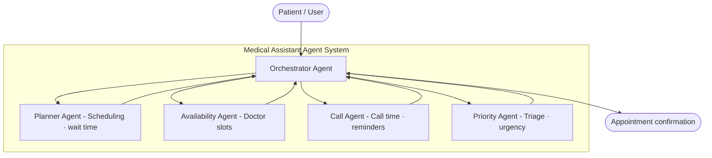

# Medical Assistant Agent — Simple Architecture + Technical

---

## 1. Identify the Problem

| Problem | Impact |
|---|---|
| No **priority** system | Emergency and routine cases wait the same |
| No **availability** check | Patient doesn't know who is free |
| No **planning** | No best-slot suggestion, no wait-time estimate |
| No **reminders** | Patients forget appointments → high no-show rate |

> **In one line:** The appointment process is slow, unorganized, and treats all patients the same.

---

## 2. Simple Architecture



### How It Works — Step by Step

```
Patient sends request
       │
       ▼
① Orchestrator receives request
       │
       ▼
② Priority Agent → classifies urgency (low / medium / high / emergency)
       │
       ▼
③ Availability Agent → finds open doctor slots from database
       │
       ▼
④ Planner Agent → picks best slot + estimates wait time
       │
       ▼
⑤ Call Agent → schedules SMS/call reminder
       │
       ▼
⑥ Orchestrator → returns confirmation to patient
```

> **Steps ② and ③ can run in parallel** — they don't depend on each other.

---

## 3. Technical Architecture — Each Agent in Detail

### 3.1 Orchestrator Agent

| Component | Details |
|---|---|
| **Job** | Receives patient request → routes to specialist agents → collects results → returns final answer |
| **Model** | GPT-4o |
| **SDK Pattern** | `Agent(handoffs=[priority, availability, planner, call])` |
| **Has Tools?** | No — uses **handoffs only** (no direct DB access) |

| Prompts | Tools | Stack | Access Control | Code Structure |
|---|---|---|---|---|
| Coordinate between agents. Always start with Priority. If emergency → skip to nearest slot. Never invent data. | None — handoffs only | OpenAI Agents SDK, GPT-4o, Redis (state), FastAPI (API) | Input: No PII, valid format. Output: must have all fields. No DB access. Handoff order enforced. | `agents/orchestrator.py`, `guardrails/input_guardrails.py`, `guardrails/output_guardrails.py` |

---

### 3.2 Priority Agent — Triage & Urgency

| Component | Details |
|---|---|
| **Job** | Classifies how urgent the case is based on symptoms only (no patient history) |
| **Model** | GPT-4o |
| **SDK Pattern** | `Agent(output_type=TriageResult)` — structured output enforced |
| **Has Tools?** | Yes — RAG lookup for triage protocols |

| Prompts | Tools | Stack | Access Control | Code Structure |
|---|---|---|---|---|
| Classify: emergency / high / medium / low. Err on caution (if in doubt → level up). Chest pain or breathing issues → minimum "high". Explain reasoning. | `lookup_triage_protocols` (RAG query for clinical triage rules) | OpenAI Agents SDK, GPT-4o, ChromaDB/Pinecone (RAG), Pydantic (TriageResult) | Output must be TriageResult. Priority whitelist only. Chest pain rule hardcoded. No booking. Read-only via RAG. | `agents/priority.py`, `tools/triage_lookup.py`, `schemas/triage.py`, `knowledge/triage_protocols/` |

**Structured Output:**

| Field | Type | Allowed Values |
|---|---|---|
| `priority` | string | `low` / `medium` / `high` / `emergency` |
| `reasoning` | string | Free text — why this level |
| `recommended_action` | string | What the system should do next |

---

### 3.3 Availability Agent — Doctor Slots

| Component | Details |
|---|---|
| **Job** | Queries the database for free doctor slots based on specialty and date |
| **Model** | GPT-4o-mini |
| **SDK Pattern** | `Agent(tools=[lookup_doctor_slots, check_doctor_schedule])` |
| **Has Tools?** | Yes — direct SQL queries |

| Prompts | Tools | Stack | Access Control | Code Structure |
|---|---|---|---|---|
| Find open slots. Return ALL (let Planner pick). NEVER invent slots. Sort by earliest. Include doctor name, time, location. | `lookup_doctor_slots` (PostgreSQL query), `check_doctor_schedule` (specific doctor) | OpenAI Agents SDK, GPT-4o-mini, PostgreSQL, Redis Cache (5-min TTL), SQLAlchemy | Read-only DB. No booking. Cache freshness ≤ 5 min. Search by specialty/date only — no patient data access. | `agents/availability.py`, `tools/slot_lookup.py`, `db/models/doctor.py`, `db/models/slot.py`, `db/cache/slot_cache.py` |

---

### 3.4 Planner Agent — Scheduling & Wait Time

| Component | Details |
|---|---|
| **Job** | Picks the best slot based on priority + availability, and estimates wait time |
| **Model** | GPT-4o |
| **SDK Pattern** | `Agent(tools=[estimate_wait_time, check_queue_depth, get_clinic_policies])` |
| **Has Tools?** | Yes — calculation tools + RAG for clinic policies |

| Prompts | Tools | Stack | Access Control | Code Structure |
|---|---|---|---|---|
| Emergency → nearest slot. High → same day. Medium → 1-2 days. Low → convenience. Priority always wins over preference. Never pick a slot not in the available list. | `estimate_wait_time` (calc), `check_queue_depth` (PostgreSQL), `get_clinic_policies` (RAG) | OpenAI Agents SDK, GPT-4o, ChromaDB/Pinecone (RAG), PostgreSQL, Python calc logic | Slot must exist in available list. Priority override enforced. Must respect clinic policies. No booking — suggest only. Wait > 60 min → flag delay. | `agents/planner.py`, `tools/wait_calc.py`, `tools/policy_lookup.py`, `schemas/plan.py`, `knowledge/clinic_policies/` |

**Wait Time Calculation (not LLM — real math):**

```
wait_time = (patients_before_slot × avg_consultation_time) + emergency_buffer(15%)
```

---

### 3.5 Call Agent — Reminders

| Component | Details |
|---|---|
| **Job** | Schedules SMS/call reminders and tracks delivery status |
| **Model** | GPT-4o-mini |
| **SDK Pattern** | `Agent(tools=[schedule_reminder, get_message_template, check_delivery_status])` |
| **Has Tools?** | Yes — scheduling + template lookup |

| Prompts | Tools | Stack | Access Control | Code Structure |
|---|---|---|---|---|
| 24h before → SMS. 2h before → call. Emergency → skip reminders. Use approved templates only. Never write custom messages. Retry failed once after 30 min. | `schedule_reminder` (Celery task), `get_message_template` (RAG), `check_delivery_status` (DB query) | OpenAI Agents SDK, GPT-4o-mini, ChromaDB/Pinecone (RAG), Twilio/Vonage (SMS/call), PostgreSQL (status), Celery + Redis (scheduling) | Template-only messages. No past-date reminders. Emergency skip. Max 1 retry. No access to symptoms or diagnosis — appointment info only. | `agents/call.py`, `tools/reminder.py`, `tools/template_lookup.py`, `integrations/twilio_client.py`, `integrations/celery_tasks.py`, `knowledge/message_templates/` |

---

## 4. Comparison — All Agents at a Glance

| | Orchestrator | Priority | Availability | Planner | Call |
|---|---|---|---|---|---|
| **Model** | GPT-4o | GPT-4o | GPT-4o-mini | GPT-4o | GPT-4o-mini |
| **Tools** | None (handoffs) | triage_lookup (RAG) | slot_lookup (SQL) | wait_calc + queue + policies (RAG) | reminder + template (RAG) + delivery |
| **Knowledge** | System prompt | RAG (triage protocols) | PostgreSQL (live data) | RAG (clinic policies) + SQL | RAG (message templates) |
| **DB Read** | No | Yes (RAG) | Yes (SQL) | Yes (SQL + RAG) | Yes (status) |
| **DB Write** | No | No | No | No | Yes (reminder status only) |
| **Key Guardrail** | Input/Output + handoff order | Chest pain rule + output type | No invent + cache freshness | Slot validation + priority override | Template-only + emergency skip |

---

## 5. Knowledge Base — RAG + What Else?

| # | Knowledge Type | What It Is | Which Agents Use It |
|---|---|---|---|
| 1 | **RAG (Vector DB)** | Store documents → retrieve relevant parts based on symptoms/request | Priority (triage rules), Planner (clinic policies), Call (message templates) |
| 2 | **SQL / API (Live Data)** | Real-time database queries for schedules and slots | Availability (doctor slots), Planner (queue depth) |
| 3 | **Rules Engine (Hard Logic)** | Code-level rules the LLM cannot override | All agents (via guardrails + output_type) |
| 4 | **Guardrails (Safety Net)** | Input/output validators that catch errors before they reach the patient | Orchestrator (input + output), all agents (output) |

> **No patient history** — the Priority Agent relies only on current symptoms + triage protocols from RAG.

---

## 6. Framework — OpenAI Agents SDK

| What You Need | How the SDK Provides It |
|---|---|
| Define agents | **Agent** — name, instructions, tools, handoffs all in one object |
| Tools (function calling) | **@function_tool** — lets agents call your Python functions |
| Handoffs (agent routing) | **handoff(agent)** — Orchestrator passes control to specialist agents |
| Structured outputs | **output_type** — forces the LLM to return exact format (e.g., TriageResult) |
| Guardrails | **@input_guardrail** and **@output_guardrail** — validate before/after |
| Runner (execution) | **Runner.run()** — runs the whole flow from start to finish |
| Tracing | **Built-in** — every agent hop and tool call is logged automatically |

---

## 7. Full Project Structure

```
medical-assistant-agent/
├── agents/
│   ├── orchestrator.py           # Orchestrator + handoffs
│   ├── priority.py               # Priority Agent + TriageResult
│   ├── availability.py           # Availability Agent
│   ├── planner.py                # Planner Agent
│   └── call.py                   # Call Agent
├── tools/
│   ├── triage_lookup.py          # RAG query for triage protocols
│   ├── slot_lookup.py            # SQL query for doctor slots
│   ├── wait_calc.py              # Wait time calculation
│   ├── policy_lookup.py          # RAG query for clinic policies
│   ├── reminder.py               # Schedule + check delivery
│   └── template_lookup.py        # RAG query for message templates
├── guardrails/
│   ├── input_guardrails.py       # No PII, valid request format
│   └── output_guardrails.py      # Complete response check
├── schemas/
│   ├── triage.py                 # TriageResult model
│   ├── plan.py                   # PlanResult model
│   └── reminder.py               # ReminderResult model
├── knowledge/
│   ├── triage_protocols/         # Source PDFs for RAG
│   ├── clinic_policies/          # Scheduling rules for RAG
│   ├── message_templates/        # SMS/call templates for RAG
│   └── embeddings/               # Pre-computed vectors
├── db/
│   ├── models/                   # SQLAlchemy models
│   ├── queries/                  # SQL queries
│   └── cache/                    # Redis cache layer
├── integrations/
│   ├── twilio_client.py          # SMS/call API wrapper
│   └── celery_tasks.py           # Scheduled task definitions
├── api/
│   └── v1/appointments.py        # FastAPI endpoints
├── docker-compose.yml
├── requirements.txt              # includes openai-agents
└── .env.example
```

---

## Quick Summary

| Question | Answer |
|---|---|
| **Problem?** | Appointment booking is slow, unorganized, no priority, no reminders |
| **Agents?** | 5 — Orchestrator + Priority + Availability + Planner + Call |
| **Framework?** | **OpenAI Agents SDK** — Agent, Runner, handoffs, tools, guardrails, tracing |
| **Knowledge?** | **RAG** (protocols, policies, templates) + **SQL** (live schedules) + **Rules Engine** (constraints) + **Guardrails** (safety) |
| **Accuracy?** | Structured outputs + real-time tools + guardrails + validation |
| **Patient history?** | No — current symptoms only |
