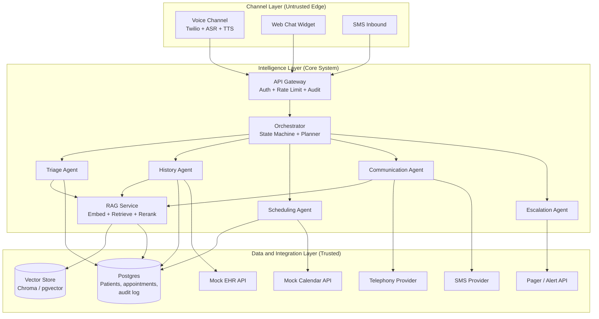
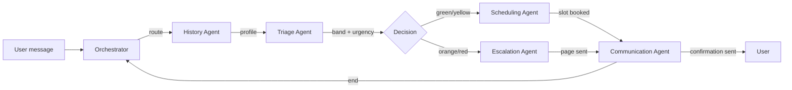
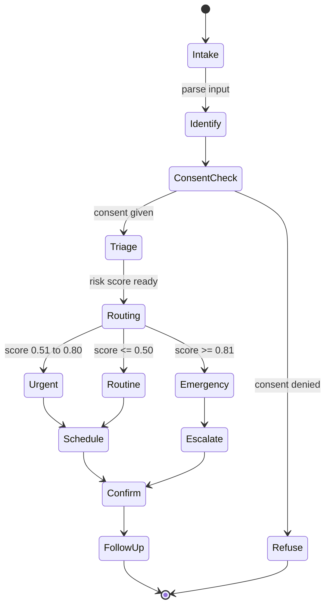
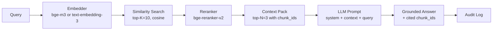
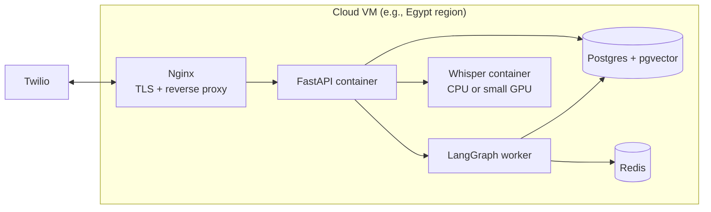

# Patient AI Assistant — Technical Framework Planning

> Diploma project: a multi-agent, RAG-grounded, voice-and-chat hospital assistant.
> Aligned with the Business Proposal that I did before [26-06-14] and designed for a 90-day pilot.

## Table of Contents
1. [Goals and Non-Goals](#1-goals-and-non-goals)
2. [Architecture Overview](#2-architecture-overview)
3. [Agent Framework Decision](#3-agent-framework--decision)
4. [Tech Stack](#4-tech-stack--decision)
5. [Agent Architecture](#5-agent-architecture--internal-design)
6. [RAG Architecture](#6-rag-architecture)
7. [Data Architecture](#7-data-architecture)
8. [Integration Layer](#8-integration-layer)
9. [Security and Compliance](#9-security--compliance-architecture)
10. [Observability](#10-observability)
11. [Repository Structure](#11-repository-structure)
12. [Testing Strategy](#12-testing-strategy)
13. [Deployment Architecture](#13-deployment-architecture)
14. [Performance Budgets](#14-performance-budgets)
15. [Development Phases](#15-development-phases)

## 1. Goals and Non-Goals
### Goals

| #   | Goal                                   | Success Looks Like                                                                 |
| --- | -------------------------------------- | ---------------------------------------------------------------------------------- |
| G1  | Multi-agent system, clear separation   | 5 agents, single responsibility each, defined communication protocol                |
| G2  | Voice and chat on a shared brain       | Same orchestrator, memory, risk score across channels                              |
| G3  | RAG-grounded answers for safety        | Every clinical answer cites a chunk ID                                             |
| G4  | Egyptian-Arabic-first                  | Works in Egyptian Arabic voice and text, MSA fallback                              |
| G5  | Compliant by design                    | Law 151/2020 controls, audit log, consent, DPO hooks from day one                  |
| G6  | Observable end-to-end                  | Every agent decision traceable, every tool call logged                             |
| G7  | Demo-ready in 90 days                  | Pilot scope achievable in one semester                                             |

### Non-Goals (Out of Scope for Diploma)
- Production-scale multi-tenant SaaS
- Real EHR integration (use mock EHR with realistic schema)
- Imaging, voice-of-customer analytics, predictive readmission
- Native mobile app (web responsive only for the pilot)
- Full Arabic NLP localization (use Arabic-capable models as-is)

## 2. Architecture Overview
### 2.1 Three-Layer View



### 2.2 Two Trust Boundaries
| Boundary      | What Crosses It                  | Controls                                                                           |
| ---           | --------------------------------------| ---------------------------------------------------------------------------------- |
| Edge to Core  | Untrusted user input   | Auth, rate limit, input guardrail, consent check               |     
| Core to Data  | Agent tool calls       | RBAC, scoped API tokens, audit log on every read/write                              |

## 3.  Agent Framework
| OPTION |	STRENGTHS	WEAKNESSES |	BEST FOR |
| ---    | ----------------------| --------  |
| LangGraph	| Graph-based, stateful, native multi-agent, great viz	Steeper learning curve |	chosen 4 this project | 
| CrewAI	| Role-based, easy to read	Less control over state	| Quick demos | 
| AutoGen (Microsoft)	| Conversational, mature	State management is looser | 	Research prototypes| 
| Semantic Kernel	| Enterprise-friendly, .NET	Smaller community | 	Microsoft shops| 
| Custom (my own)	Full control	| Reinventing the wheel	| Last resort| 

**Why did I chose LangGraph.** As it maps directly to the swim-lane diagram, supports the planner-orchestrator pattern, and is the most commonly taught framework in this diploma.

## 4. Tech Stack
| LAYER  | CHOICE	          | WHY
| ---    | -----------------| --------  |
| Language	| Python 3.11+	| LLM ecosystem standard |
| Agent framework	| LangGraph + LangChain	| Multi-agent native|
| LLM (primary but not available right now)	| GPT-4o or Claude 3.5 Sonnet	| Best reasoning, multilingual, tool use|
| LLM (fallback)	| Llama 3.1 70B (self-hosted) or Mistral	| Cost control, offline mode|
| ASR	| Whisper-large-v3 (local) or Deepgram	| Egyptian Arabic support|
| TTS	| ElevenLabs or Coqui XTTS	| Natural Egyptian Arabic voices|
| Vector DB	| Chroma (dev) to pgvector (prod)	| Same engine as Postgres = simpler ops|
| Relational DB	| PostgreSQL 16	| Mature, JSONB, pgvector extension|
| Cache	| Redis	| Session state, rate limits|
| Telephony	| Twilio (programmable voice)	| Reliable, well-documented|
| SMS	| Twilio or local SMS provider	| Same vendor for voice and SMS|
| Backend	| FastAPI	| Async, fast, OpenAPI docs free|
| Frontend (chat)	| Next.js or simple HTML/JS widget |	Easy embed into hospital portal
| Orchestration	| Docker Compose (dev) to Kubernetes (prod)	| Standard |
| Observability	| LangSmith (dev) + OpenTelemetry + Grafana |	Full traceability |
| Eval	| Ragas + custom Python scripts	| Free, open source |
| Auth	| OAuth 2.0 (patient: phone OTP, staff: SSO) |	Standard |

### 4.2 Cost Estimate (Pilot, 90 days, ~500 interactions/day)
| COMPONENT    | MONTHLY COST (USD)|
| ---------    | -----------------|
| LLM API (~$0.02 per interaction)	| $300| 
| ASR + TTS	| $200| 
| Twilio (voice + SMS)	| $400| 
| Cloud (small VM + DB)	| $150| 
| Observability	| $50| 
| Total per month	| ~$1,100| 
| Pilot total (3 months)	| ~$3,300| 

## 5. Agent Architecture — Internal Design
### 5.1 Per-Agent Contract

```python
class Agent:
    name: str
    description: str    # used by orchestrator to decide when to call
    tools: list[Tool]   # tools the orchestrator can grant access to
    memory_scopes: list[str]  # which memory layers it can read/write

    async def run(self, state: SessionState) -> AgentOutput:
        """Pure function: state in, decision out."""
```

### 5.2 The Five Agents
| AGENT	| RESPONSIBILITY	| TOOLS	| MEMORY ACCESS| 
| ---------    | ---------| --------- | ------------------------|
| Triage	| Collect symptoms, compute score	ask_symptom, score_risk, retrieve_protocol	| Patient history (read)| 
| History	| Load and update patient profile	get_patient, update_profile, search_episodes| Patient DB (R/W), vector (R/W)| 
| Scheduling	| Find and book slots	find_slots, book_slot, cancel_slot	| Calendar (R/W)| 
| Communication	| Speak and send messages	send_sms, make_call, tts_speak	| Session (R/W)| 
| Escalation| 	Page clinician, hand off	page_clinician, open_voice_bridge, send_summary	| Session (R), audit (W)| 

#### 5.2.1 Agent Input / Output 
This is the contract each agent implements. It will be put intodocs/agent-contracts.md in the repo. It is the source of truth for what goes in, what comes out, and what gets persisted.

**0. The Shared State (What Every Agent Reads & Writes)** Every agent operates on the sameSessionState object passed by the orchestrator.
```python
from pydantic import BaseModel, Field
from typing import Literal, Optional
from datetime import datetime

Channel = Literal["voice", "chat", "sms"]
Language = Literal["ar-EG", "ar-MSA", "en"]
Band = Literal["green", "yellow", "orange", "red"]

class Message(BaseModel):
    role: Literal["user", "assistant", "system", "tool"]
    content: str
    ts: datetime
    agent: Optional[str] = None      # which agent produced it
    tool_call_id: Optional[str] = None

class PatientRef(BaseModel):
    patient_id: Optional[str] = None   # null for new patients
    phone: Optional[str] = None
    name: Optional[str] = None
    language: Language = "ar-EG"
    consent_granted: bool = False
    consent_scope: list[str] = []       # ["clinical", "scheduling", ...]

class SessionState(BaseModel):
    # Identity & session
    session_id: str
    channel: Channel
    started_at: datetime
    patient: PatientRef

    # Conversation
    messages: list[Message] = []

    # Working memory (each agent reads/writes its own slice)
    triage: Optional["TriageOutput"] = None
    history: Optional["HistoryOutput"] = None
    scheduling: Optional["SchedulingOutput"] = None
    escalation: Optional["EscalationOutput"] = None

    # Routing control
    current_step: Literal[
        "intake", "identify", "consent", "triage",
        "schedule", "escalate", "confirm", "followup", "end"
    ] = "intake"
    next_agent: Optional[str] = None
    end_session: bool = False

    # Observability
    trace: list[dict] = []              # append-only agent decisions
```
**1. Orchestrator
1.1 Input**
|  FIELD | 	SOURCE |
| ---------|---------|
| SessionState (current)	| In-memory, from previous step| 
| New user message	| Channel adapter (voice ASR or chat)| 

**1.2 Output**
|  FIELD	|  EFFECT |
| ---------|---------|
|  next_agent	|  Name of the next agent to invoke (triage,history, etc.) orNone |
|  current_step	|  New state in the state machine |
|  messages (append)	|  Adds system / clarifying question to user |
|  end_session	|  True if session should close |
|  trace (append)	|  One entry per routing decision |

**Tools Available**
-route_to_agent(agent_name: str, reason: str)
-ask_user(question: str, language: str)
-end_session(reason: str)

**Example**
```python
# Input state
state.next_agent == None
state.messages[-1].content == "I have chest pain"

# Orchestrator decision
state.next_agent = "history"
state.current_step = "identify"
state.trace.append({"agent":"orch","decision":"route_to_history","reason":"load profile before triage"})
```
**2. History Agent
2.1 Input**
| FIELD	TYPE	| REQUIRED| 	NOTES| 
| ---------|---------|---------|
| patient.phone	| string	| yes (one of three)	| Used to look up returning patient| 
| patient.name	| string	| no	| Helpful if phone not on file| 
| patient.patient_id	| string	| no	| Direct lookup if known| 
| action	| enum	| yes	| get_profile,update_profile,search_episodes,add_episode| 
| update_payload| 	object	| conditional	| Required ifaction == update_profile| 
| search_query	| string	| conditional	| Required ifaction == search_episodes| 
| episode_summary	| string	| conditional	| Required ifaction == add_episode| 
   
**2.2 Output**
```python
class HistoryOutput(BaseModel):
    found: bool
    patient_id: Optional[str] = None
    name: Optional[str] = None
    age: Optional[int] = None
    sex: Optional[Literal["M", "F"]] = None
    language: Language = "ar-EG"

    # Clinical summary
    conditions: list[str] = []          # ["hypertension", "type-2 diabetes"]
    allergies: list[str] = []
    medications: list[str] = []
    prior_visits: int = 0
    last_visit_date: Optional[datetime] = None

    # Episodic memory (from vector search)
    similar_episodes: list[dict] = []   # [{episode_id, date, summary, score}]
    is_returning: bool = False

    # For audit
    sources: list[str] = []             # chunk_ids retrieved
    confidence: float = 1.0
```

**Tools Available**
-lookup_patient(phone | name | patient_id) -> PatientRecord
-search_episodes(patient_id, query, top_k=5) -> list[Episode]
-update_profile(patient_id, fields) -> PatientRecord
-add_episode(patient_id, summary, embedding) -> Episode

**Side Effects**
- Read:patient_db,patient_episodes vector store
- Write:patient_db (only ifupdate_profile),audit_log
- Append to:state.history,state.patient,state.trace

**Validation Rules**
-consent_granted == True required before any read of clinical data
Phone format: Egyptian mobile (^01[0125]\d{8}$) or international
-update_profile allowed fields whitelist: name, language, contact preferences only (not clinical fields)

**Error Cases** (To be Added)

3. Triage Agent
3.1 Input
3.2 Output

4. Scheduling Agent
4.1 Input
4.2 Output
   
5. Communication Agent
5.1 Input
5.2 Output

6. Escalation Agent
6.1 Input
6.2 Output

**Cross-Agent Data Flow**


### 5.3 Orchestrator State Machine

## 6. RAG Architecture
### 6.1 Knowledge Bases
| STORE	| CONTENT	| EMBEDDING CADENCE	| ACCESS|
| ---------    | ---------| --------- | ------------------------|
| Clinical KB	| NICE / WHO triage protocols, red-flag lists	| Re-indexed weekly	| Triage Agent only| 
| Patient Memory| 	Prior visit summaries, chat logs	| Real-time on write	| History Agent only| 
| Hospital FAQ| 	Hours, policies, prep instructions	| Re-indexed on edit	| Communication Agent|

### 6.2 Retrieval Pipeline

### 6.3 Prompt Template Pattern
```python
SYSTEM:
You are a hospital triage assistant. You NEVER diagnose. You only assess
urgency and route. You MUST cite a source chunk for any clinical claim.

CONTEXT (retrieved, ranked):
[1] {{chunk_id}}: {{chunk_text}}
[2] {{chunk_id}}: {{chunk_text}}
[3] {{chunk_id}}: {{chunk_text}}

PATIENT CONTEXT:
{{patient_profile_summary}}

CONVERSATION:
{{history}}

USER: {{current_input}}

RESPONSE FORMAT (JSON):
{
  "intent": "...",
  "risk_score": 0.0,
  "band": "green|yellow|orange|red",
  "next_action": "...",
  "explanation_for_patient_ar": "...",
  "explanation_for_patient_en": "...",
  "cited_chunks": ["...", "..."]
}
```
## 7. Data Architecture
### 7.1 Database Schema (Minimal Pilot)

| TABLE	| PURPOSE	| KEY COLUMNS| 
| ------| --------| ---------  |
| patients	| Profile	| id, name, phone, dob, language, consent_ts | 
| patient_clinical | 	History | summary	patient_id, conditions[], allergies[], meds[] | 
| encounters 	| 	Each interaction	| 	id, patient_id, channel, started_at, ended_at, agent_trace	| 
| appointments		| Bookings	| 	id, patient_id, doctor_id, slot, status	| 
| doctors		| Staff		| id, name, specialty, schedule_json	| 
| audit_log		| Compliance		| ts, actor, action, agent, tool, input_hash, output_hash	| 
| consent_records	| 	Law 151		| patient_id, scope, granted_at, revoked_at	| 

### 7.2 Vector Store Schema

| COLLECTION	| DOC SCHEMA| 
| ------------| ----------|
| clinical_protocols	| {chunk_id, source, guideline, section, text, embedding, version}| 
| patient_episodes	| {patient_id, encounter_id, summary, embedding, ts} | 
| hospital_faq	| {chunk_id, category, question, answer, embedding, updated_at} | 

## 8. Integration Layer
### 8.1 Mock vs Real
| INTEGRATION	| PILOT	| PRODUCTION| 
| ------------| ------| --------- |
| EHR	| Mock REST API with 50 fake patients	| HL7 FHIR adapter| 
| Calendar| 	JSON file of doctor slots| 	Google Calendar / hospital HIS API| 
| Telephony	| Twilio sandbox	| Twilio production number| 
| SMS	| Twilio test creds	| Twilio production| 
| Pager	| Mock (logs page to DB)	| Real pager / on-call system| 

### 8.2 API Style

- All inter-service calls: REST + JSON (simple, debuggable).
- All agent-to-orchestrator calls: in-process function calls (no network hop).
- All external webhooks: signed + idempotent.

## 9. Security and Compliance Architecture
| CONTROL	| IMPLEMENTATION | 
| ----------| ----------|
| Encryption at rest |	Postgres TDE, encrypted vector store | 
| Encryption in transit	| TLS 1.3 everywhere | 
| Auth (patient)	| Phone OTP, 5-min TTL | 
| Auth (staff)	| OAuth 2.0 via hospital SSO | 
| Auth (service-to-service)	| mTLS or signed JWTs | 
| Authorization	| RBAC: patient sees own data only, staff sees assigned only | 
| Consent capture	| At first contact, stored inconsent_records, revocable | 
| Right to access	| Self-service API:GET /patients/{id}/export | 
| Right to delete	| Soft delete + scheduled hard delete (legal hold aware) | 
| Audit log	| Append-only, hash-chained, 5-year retention | 
| PII in logs	| Redacted; raw text only in encrypted audit table | 
| Secret management	| Environment variables via Doppler / Vault (not in code) | 
| DPIA	| Document maintained in repo, versioned | 
| Penetration testing	| Pre-pilot (even a basic one) | 


## 10. Observability
| LAYER	| TOOL	| CAPTURES| 
| ---------    | ---------  | --------- |
| Agent traces | LangSmith	| Every LLM call, tool call, decision	| 
| App logs	| Structured JSON → OpenTelemetry → Grafana		| All HTTP, errors, latency	| 
| Metrics 	| 	Prometheus + Grafana dashboards		| AHT, FCR, latency, error rate, cost per interaction	| 
| Audit		| Postgres + signed export		| Compliance, legal, incident response	| 
| User feedback		| Post-interaction CSAT prompt		| atient satisfaction, regression detection	| 
| Eval suite		| Ragas + custom		| Triage accuracy, RAG groundedness, agent behavior	| 

### 10.1 Trace Example (per interaction)
```python
[14:32:01] Intake      -> channel=voice, lang=ar-EG
[14:32:01] Identify    -> patient=12345 (returning)
[14:32:02] Consent     -> scope=clinical, granted=true
[14:32:03] History.get -> profile loaded in 180ms
[14:32:04] Triage.run  -> asked 4 questions, took 2 turns
[14:32:09] Triage.score-> 0.88, band=RED, chunks=[KB-042, KB-057]
[14:32:09] Escalate    -> paged Dr. Hassan, ack in 8s
[14:32:18] Bridge      -> voice bridge opened
[14:32:45] Schedule    -> follow-up booked 2026-06-16 10:00
[14:32:46] Confirm     -> SMS sent
[14:32:46] End -> duration=45s, AHT_band=routine->escalation
```
## 11. Repository Structure
```python
patient-ai-assistant/
├── README.md
├── LICENSE
├── pyproject.toml
├── docker-compose.yml
├── .env.example
├── apps/
│   ├── api/                          # FastAPI backend
│   │   ├── main.py
│   │   ├── routes/
│   │   │   ├── chat.py
│   │   │   ├── voice.py
│   │   │   └── admin.py
│   │   └── middleware/
│   │       ├── auth.py
│   │       ├── consent.py
│   │       └── audit.py
│   ├── agents/                       # LangGraph agents
│   │   ├── orchestrator.py
│   │   ├── triage.py
│   │   ├── history.py
│   │   ├── scheduling.py
│   │   ├── communication.py
│   │   ├── escalation.py
│   │   └── shared/
│   │       ├── tools.py
│   │       ├── prompts.py
│   │       └── schemas.py
│   ├── rag/                          # RAG pipeline
│   │   ├── embedder.py
│   │   ├── retriever.py
│   │   ├── reranker.py
│   │   └── indexer.py
│   ├── channels/                     # Voice and SMS
│   │   ├── twilio_voice.py
│   │   ├── twilio_sms.py
│   │   └── asr_tts.py
│   └── eval/                         # Evaluation suite
│       ├── ragas_eval.py
│       ├── triage_accuracy.py
│       └── conversation_traces.py
├── data/
│   ├── synthetic/                    # Generated patient data
│   ├── knowledge/                    # Source PDFs, guidelines
│   └── eval/                         # Gold standard test cases
├── infra/
│   ├── docker/
│   ├── k8s/                          # (future)
│   └── terraform/                    # (future)
├── docs/
│   ├── business-proposal.md
│   ├── technical-framework.md
│   ├── dpia.md
│   ├── api.md
│   └── runbook.md
└── tests/
    ├── unit/
    ├── integration/
    └── e2e/
```
## 12. Testing Strategy 
| LAYER	| TEST TYPE	| TOOL	| PASS CRITERIA| 
| ---------    | ---------| --------- | ------------------------|
| Tools	| Unit	| pytest	| Each tool returns expected schema| 
| Agents	| Unit	pytest + golden traces	| Given input → expected tool calls + output| 
| RAG	Eval	| Ragas	| Faithfulness > 0.9, context precision > 0.8| 
| Triage| 	Eval	| Custom + clinician review	| Risk score agreement > 90% with gold, under-triage < 1%| 
| Orchestrator	| Integration	pytest	| State transitions correct, no orphan sessions| 
| API	| Integration	| pytest + httpx	| All endpoints contract-tested| 
| Channels	| Smoke |	Twilio test creds	| Voice call round-trips, SMS delivers| 
| E2E	| Scenario	| Playwright + Twilio	| 10 golden patient journeys pass| 
| Safety	| Red team	| Manual + automated	| No diagnosis leakage, no jailbreak success| 
| Performance	| Load	| k6 / Locust	| p95 latency < 3s at 50 concurrent users| 

## 13. Deployment Architecture
### 13.1 Pilot Deployment (Docker Compose on single VM)


### 13.2 Production Targets (Future, Post-Diploma)

- Cloud: Local hyperscaler region in Egypt (or nearest MENA region).
- Orchestration: Kubernetes (3 app pods, 2 worker pods, HA Postgres).
- LLM: Mix of API + self-hosted open model for cost.
- CDN / WAF: In front of API.
- DR: Daily snapshots, RPO 24h, RTO 4h.

## 14. Performance Budgets

## 15. Development Phases
