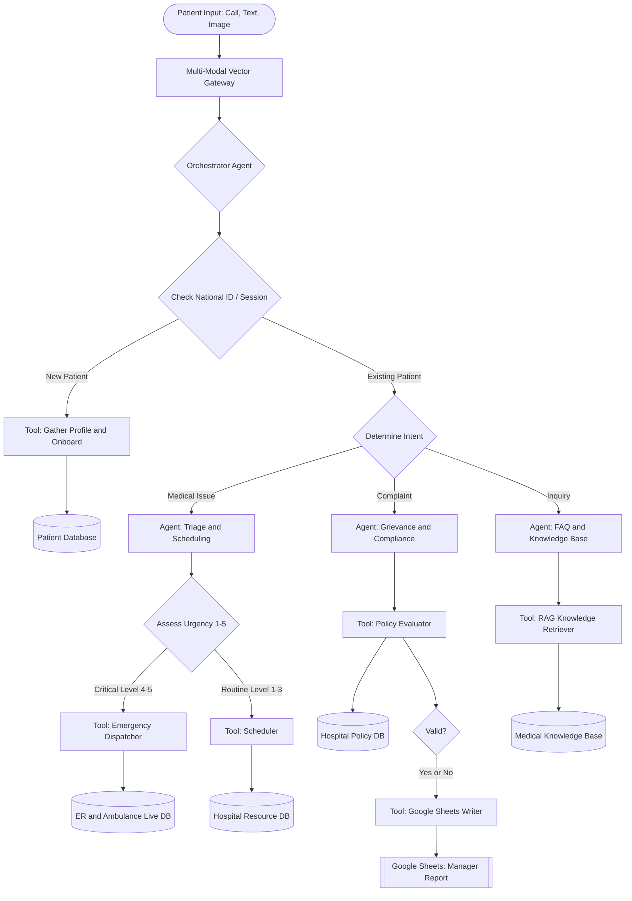

# Multi-Modal Hospital Patient Assistant - Technical Structure

---

## 1. Identify the Problem

Hospitals receive patient requests through calls, text messages, and images. The system must understand the input, identify whether the patient is new or existing, route the request to the right specialist agent, and connect each agent to reliable tools and databases.

- New patients need profile collection and onboarding before service can continue
- Existing patients may ask about a medical issue, complaint, or general inquiry
- Medical issues need urgency assessment before scheduling or emergency dispatch
- Complaints need policy validation and manager reporting
- Inquiries need a trusted medical knowledge base instead of guessed answers

> **The problem in one line:**
> Patient communication is multi-channel and multi-intent, so the assistant needs structured routing, specialized agents, validated tools, and trusted databases.

---

## 2. Agent Struc

The system uses **5 main agents** supported by tools and databases:

### What Each Agent Does

| #   | Agent                              | Job                                                              | Input                                            | Output                                                    |
| --- | ---------------------------------- | ---------------------------------------------------------------- | ------------------------------------------------ | --------------------------------------------------------- |
| 1   | **Multi-Modal Vector Gateway**     | Converts calls, text, and images into normalized patient context | Audio, text, image, metadata                     | Clean request text and extracted signals                  |
| 2   | **Orchestrator Agent**             | Controls routing and decides the next workflow step              | Normalized patient request                       | Route to ID/session check, onboarding, or intent handling |
| 3   | **Triage and Scheduling Agent**    | Handles medical issues and decides urgency                       | Symptoms, complaint details, patient context     | Urgency level and next action                             |
| 4   | **Grievance and Compliance Agent** | Handles complaints and checks them against hospital policy       | Complaint text, department, patient/session info | Validity decision and report entry                        |
| 5   | **FAQ and Knowledge Base Agent**   | Answers general inquiries using trusted medical content          | Patient question                                 | Retrieved answer with source context                      |

### Why These Agents Are Needed

- **Gateway** is needed because patient input can arrive as voice, text, or image
- **Orchestrator** is needed because the same patient channel can contain different intents
- **Triage and Scheduling** is needed to separate critical cases from routine appointments
- **Grievance and Compliance** is needed so complaints follow policy and reporting rules
- **FAQ and Knowledge Base** is needed to answer inquiries from approved knowledge instead of model memory

---

## 3. Workflow Details

### Step 1: Patient Input

The patient sends a request through one of three channels:

| Channel | Processing Need                                          |
| ------- | -------------------------------------------------------- |
| Call    | Speech-to-text, speaker cleanup, intent extraction       |
| Text    | Language detection, entity extraction, intent extraction |
| Image   | OCR or visual extraction, medical document/image routing |

### Step 2: Gateway and Orchestration

The **Multi-Modal Vector Gateway** standardizes the request, then sends it to the **Orchestrator Agent**. The orchestrator checks whether the system has a known **National ID** or active **session**.

| Condition        | Action                               |
| ---------------- | ------------------------------------ |
| New patient      | Run onboarding tool and save profile |
| Existing patient | Continue to intent detection         |

### Step 3: Intent Routing

Existing patient requests are routed into one of three intent paths:

| Intent        | Routed To                      | Main Tools                             |
| ------------- | ------------------------------ | -------------------------------------- |
| Medical Issue | Triage and Scheduling Agent    | Emergency Dispatcher, Scheduler        |
| Complaint     | Grievance and Compliance Agent | Policy Evaluator, Google Sheets Writer |
| Inquiry       | FAQ and Knowledge Base Agent   | RAG Knowledge Retriever                |

---

## 4. Tools and Databases

| Tool / Database                | Purpose                                                            | Connected Component      |
| ------------------------------ | ------------------------------------------------------------------ | ------------------------ |
| **Gather Profile and Onboard** | Collects patient name, National ID, phone, basic info, and consent | New patient path         |
| **Patient Database**           | Stores patient profile and session identity                        | Onboarding               |
| **Emergency Dispatcher**       | Sends critical cases to ER or ambulance workflow                   | Triage critical path     |
| **ER and Ambulance Live DB**   | Tracks emergency resources and live dispatch status                | Emergency Dispatcher     |
| **Scheduler**                  | Books routine appointments and allocates hospital resources        | Triage routine path      |
| **Hospital Resource DB**       | Stores doctors, rooms, slots, and availability                     | Scheduler                |
| **Policy Evaluator**           | Checks whether a complaint is valid against hospital policy        | Grievance and Compliance |
| **Hospital Policy DB**         | Stores complaint rules, SLA rules, escalation policy               | Policy Evaluator         |
| **Google Sheets Writer**       | Writes complaint decisions into manager report sheet               | Complaint reporting      |
| **Manager Report Sheet**       | Gives managers a structured view of complaint outcomes             | Google Sheets Writer     |
| **RAG Knowledge Retriever**    | Retrieves approved medical and hospital FAQ content                | FAQ and Knowledge Base   |
| **Medical Knowledge Base**     | Stores trusted inquiry answers and medical guidance                | RAG Knowledge Retriever  |

---

## 5. Accuracy and Reliability

| Risk                      | Problem                                                           | Solution                                                                                |
| ------------------------- | ----------------------------------------------------------------- | --------------------------------------------------------------------------------------- |
| Wrong patient identity    | Request is linked to the wrong patient                            | Require National ID/session match before existing-patient routing                       |
| Poor transcription or OCR | Voice/image input may be misunderstood                            | Gateway returns confidence scores and asks for clarification when confidence is low     |
| Wrong intent              | Complaint may be routed as inquiry, or medical issue as complaint | Use structured intent output with fixed labels: `medical_issue`, `complaint`, `inquiry` |
| Under-triage              | Critical symptoms may be treated as routine                       | Triage agent uses urgency scale 1-5 and emergency guardrails for red-flag symptoms      |
| Hallucinated answer       | FAQ agent may invent information                                  | FAQ agent must answer only from retrieved Medical Knowledge Base context                |
| Invalid complaint report  | Complaint record may miss required fields                         | Output validation before writing to Google Sheets                                       |

### Accuracy Best Practices

1. **Structured Outputs** - Use fixed schemas for identity, intent, urgency, complaint validity, and final response.
2. **Live Data Tools** - Use databases for patient profile, resources, policy, emergency status, and knowledge retrieval.
3. **Guardrails** - Block unsafe medical advice and escalate emergency symptoms.
4. **Human Review** - Send critical emergency cases and sensitive complaints to staff review when needed.
5. **Tracing** - Log every route, tool call, and database update for auditability.

---

## 6. Knowledge Base and Data Strategy

| Component                      | Data Source                                | Data Type                  |
| ------------------------------ | ------------------------------------------ | -------------------------- |
| Multi-Modal Vector Gateway     | Transcription/OCR models, embeddings       | Multi-modal extraction     |
| Orchestrator Agent             | Routing instructions and session state     | System prompt and state    |
| Triage and Scheduling Agent    | Triage protocols and resource availability | RAG and live database      |
| Grievance and Compliance Agent | Hospital policy and complaint SLA rules    | Policy DB and rules engine |
| FAQ and Knowledge Base Agent   | Approved hospital FAQ and medical guidance | RAG                        |
| Reporting Layer                | Google Sheets manager report               | Structured operational log |

> **Important:** The LLM should not invent doctors, policies, available slots, or medical answers. These must come from approved tools and databases.

---

## 7. Suggested Framework - OpenAI Agents SDK

| Requirement          | SDK Feature                                     |
| -------------------- | ----------------------------------------------- |
| Define agents        | `Agent` objects with instructions and tools     |
| Route between agents | Handoffs from orchestrator to specialist agents |
| Call hospital tools  | `@function_tool` for database/API operations    |
| Validate outputs     | Structured outputs with Pydantic models         |
| Add safety checks    | Input and output guardrails                     |
| Track decisions      | Built-in tracing for routes and tool calls      |

---

## Quick Summary Table

| Question                      | Answer                                                        |
| ----------------------------- | ------------------------------------------------------------- |
| **Main input?**               | Patient call, text, or image                                  |
| **First technical layer?**    | Multi-Modal Vector Gateway                                    |
| **Main controller?**          | Orchestrator Agent                                            |
| **Identity check?**           | National ID or active session                                 |
| **New patient path?**         | Gather Profile and Onboard, then Patient Database             |
| **Existing patient intents?** | Medical issue, complaint, inquiry                             |
| **Medical issue path?**       | Triage and Scheduling, urgency 1-5, emergency or scheduler    |
| **Complaint path?**           | Grievance and Compliance, policy evaluator, manager report    |
| **Inquiry path?**             | FAQ and Knowledge Base with RAG retrieval                     |
| **Main safety method?**       | Structured outputs, guardrails, live tools, and audit tracing |
